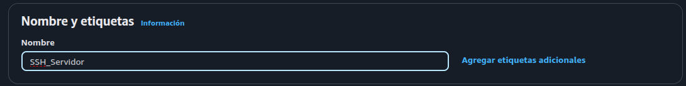
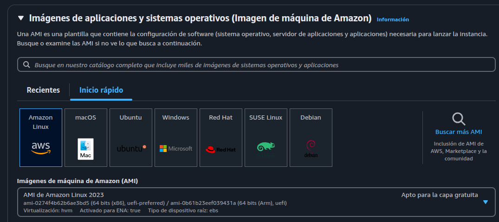
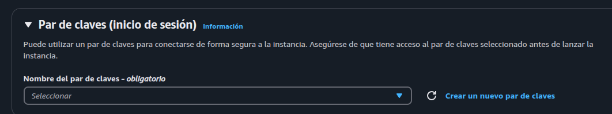
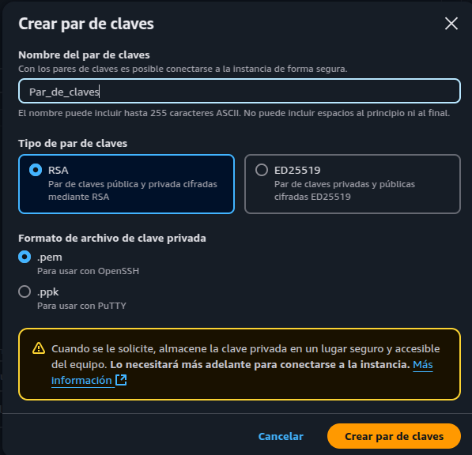
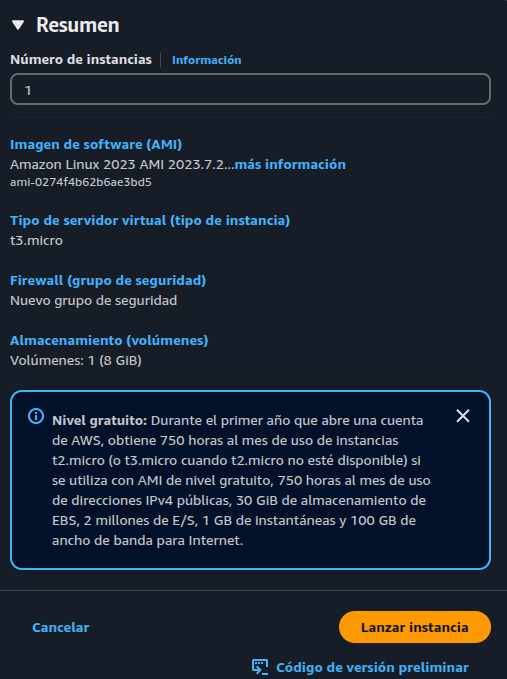
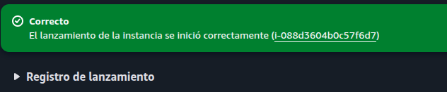
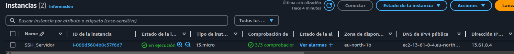

# Parte 1

En este apartado crearemos una instancia utilizando Amazon Web Services (AWS). Dentro de la plataforma crearemos una instancia (máquina). Se generará un par de claves SSH y se configurará el acceso al servidor sin contraseña, demostrando cómo este método puede ser implementado de manera efectiva en un entorno

Vamos a documentar el proceso que hemos seguido para generar la instancia y después con un .gif mostraremos como nos conectamos a la máquina.

## Configuración instancia

En este apartado le agregamos el nombre que va a tener la instancia.

Escogeremos como imagen el Amazon Linux.

Agregaremos un nuevo par de claves para el inicio de sesión sin necesidad de credenciales.

Escogeremos el RSA como tipo de par de claves y el formato del archivo de clave privada será .pem ya que estamos en Ubuntu y vamos a usar OpenSSH.

Estas claves tendremos que guardarlas en nuestro sistema.

Una vez acabada la configuración de la instancía le daremos a "Lanzar instancia"

Podemos ver como nos la ha creado.

Y aquí vemos nuestra instancia creada.

## Conexión al servidor

Aquí podemos ver como nos conectamos a la IP del servidor. Para conectarnos nos hará falta lo siguiente:

- Nombre usuario: por defecto en AWS para las máquinas de Amazon Linux el usuario predefinido es `eco2-user`
- IP de la instancia: en los detalles de la instancia podemos ver su IP
- SSH: nos hará falta tener instalada la aplicación de OpenSSH
- Clave RSA: nos hará falta la clave par que hemos creado en la configuración

Comando: `sudo ssh -i ubicación_clave_RSA usuario@IP`

[Video de la conexión](https://drive.google.com/file/d/15uWR7sOGq22aSxRWWzP5XMKoxNPuJAKR/view?usp=sharing)   
   
[Descarga .gif debido a que pesa mucho](https://drive.google.com/file/d/14QX7jxhvdsWKfcU9GvU5RVUOocTpYXvv/view?usp=sharing)
