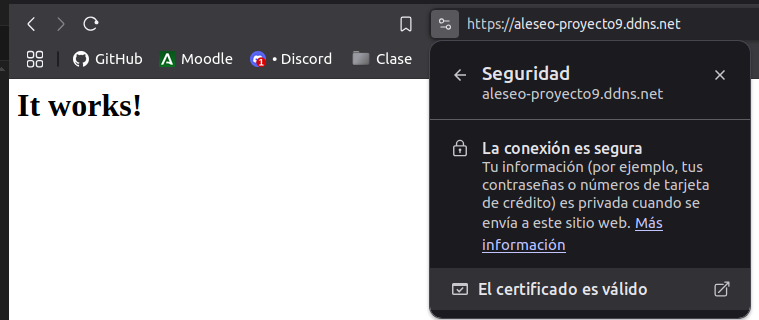
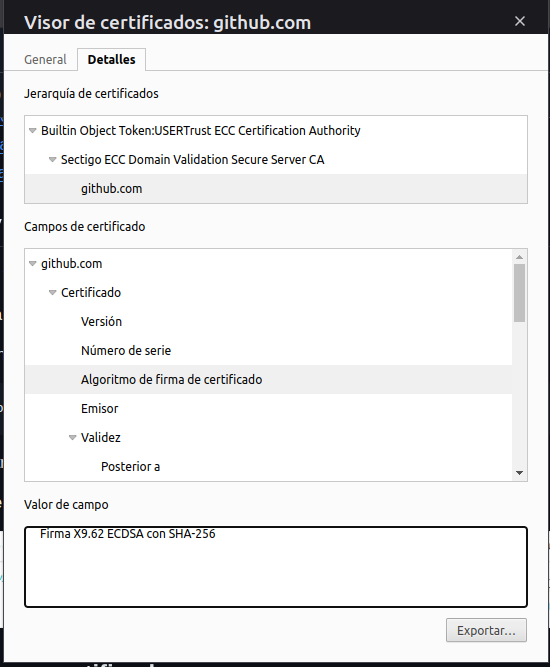

# Apartado 2

## Instalación y comprobación del servidor web

Como hemos dicho anteriormente vamos a realizar la instalación del servicio web en la misma máquina del apartado1.

Actualizamos los respositorios de la máquina.

Una vez actualizados procedemos a instalar apache en nuestro Amazon Linux. Este paquete en esta SO se llama `httpd`.

Una vez instalado procedemos a activar el servicio y comprobar que esta activo.

## Activación firewall de AWS

Para poder acceder desde fuera de la instancia al servidor web deberemos activar las reglas de entrada de nuestra instancia las cuales nos permiten entrar desde fuera a los puertos del servicio web.

Para poder acceder a las reglas de entrada tendremos que irnos a la información de la instancia.

Entraremos en la pestaña de `Seguridad`.
Aquí podemos ver las reglas que tenemos de entrada y salida. Para poder configurarlas pincharemos en "Grupos de seguridad".

Una vez aquí podemos ver como nos aparecen las reglas de entrada. Para agregar las reglas que queremos le daremos a "Editar reglas de entrada".

Dentro nos aparecerá el botón "Agregar regla". Aparte nos aparece la regla que ya esta creada que permite la conexión SSH.

Al ser un servicio web tendremos que activar reglas para el puerto 80 (HTTP) y 443 (HTTPS). En el apartado de origen pondremos 0.0.0.0/0 (todas las IPs). Una vez acabado le daremos a "Guardar reglas".

Y ya hemos añadido las dos reglas de entrada.

Podemos ver como si nos metemos al servicio web en el puerto 80 nos aparece correctamente funcionando.

Si nos conectamos al puerto 443 o HTTPS vemos que no nos funciona debido a que no tenemos un certificado.

## Configuración HTTPS

Para el HTTPS nos hace falta registrar un nombre de dominio que apunte a la IP de nuestra instancia y generar nuestro propio certificado dentro del ssistema.

### Resgistrar nombre de dominio

Preguntandole a Perplexity sitios donde poder resgitrar un nombre de dominio gratis que apunte a la IP de nuestra instancia nos recomendo 2 sitios: DuckDNS y NoIP.

Hemos escogido NoIP debido a que tiene interfaz online y es bastante fácil de usar mientras al entrar en la web de DuckDNS había que instalar una aplicación para poder hacerlo.

Hemos generado el siguinete nombre DNS.

### Generar nuestro propio certificado

Haciendo una búsqueda nos recomiendan Certbot para generar certificados.

Lo primero que haremos será intalar los paquetes y dependencias de apache.

Crearemos el archivo de configuración para el dominio y metemos la configuración. 

Una vez configurado el archivo ejecutamos el comando para generar el certificado. Este nos da un error de que ya hay un certificado en uso que es el de localhost, por lo que tendremos que acceder al archivo y comentar 2 lineas. 

Comentamos estas dos lineas para que no utilice ese certificado.

Y volvemos a ejecutar el comando de antes forzando a que renueve el certificado.

Nos pedirá que respondamos a algunas preguntas.

Comprobamos que este la configuración correcta

También vamos a crear un archivo de apache para el HTTPS. 

Le añadiremos los parametros de configuración en relación a nuestro nombre de dominio. 

Una vez reiniciemos el servicio ya podremos conectarnos a nuestro servidor web a través del nombre de dominio que hemos creado.

Podemos comporbar que nos detecta el certificado y que lo valida el navegador.

### Comprobación certificado propio vs certificado otra página

Aquí podemos ver los detalles del certificado que hemos creado.

Y aquí podemos ver los detalles del certificado que tiene la gitpage del proyecto 9 de bastionados.

Como podemos ver podemos comparar diferentes parametros que salen diferentes:

- Nombre común (CN): E5 vs Sectigo ECC Domain Validation Secure Server CA

- Organización (O): Let's Encrypt vs Sectigo Limited

- Diás para vencimiento: 3 meses vs 1 año

- Algoritmo de firma de certificado: Firma X9.62 ECDSA con SHA-384 vs Firma X9.62 ECDSA con SHA-256