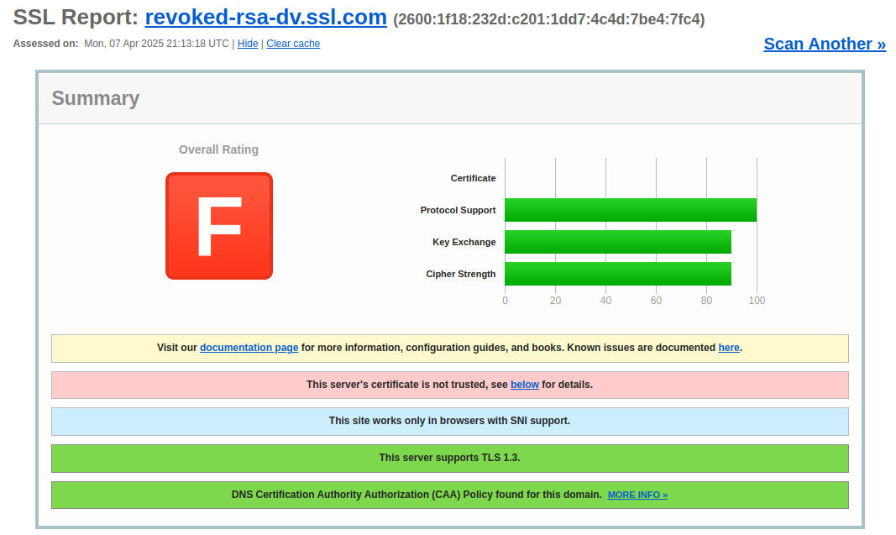

# Apartado 3

## Evaluación de mi certificado

He utilizado el servicio SSL Labs (https://www.ssllabs.com/ssltest/) para analizar el certificado mi sitio web. En los resultados , el certificado se considera válido por los siguientes motivos:

- Fechas de validez correctas: El certificado tiene un período de validez activo (90 días).

- Coincidencia del nombre de dominio: El certificado ha sido emitido para el dominio. Esto significa que el nombre del dominio en el certificado coincide exactamente con el nombre del dominio del sitio web.

- Algoritmo de firma seguro: El certificado utiliza un algoritmo de firma seguro (SHA-384 con RSA).

- Emitido por una entidad confiable: La entidad emisora es R3 (Let’s Encrypt), que es ampliamente reconocida por los navegadores y sistemas operativos modernos.

- Soporte de cifrado fuerte: En el análisis de SSL Labs, el servidor ha sido configurado para usar protocolos y suites criptográficas seguras.

## Evaluación de otros certificados

### revoked-rsa-dv.ssl.com

Motivo por el que el certificado es no válido:

- Certificado revocado: El certificado ha sido revocado por la autoridad certificadora, lo que invalida su uso incluso si no ha expirado. Esto hace que los navegadores marquen este sitio como inseguro. 

### expired-rsa-ev.ssl.com

Motivo por el que el certificado es no válido:

Certificado expirado: La fecha de validez del certificado ya ha pasado. El certificado ya no está vigent por lo que los navegadores no pueden garantizar la seguridad del sitio porque el certificado ya no es válido temporalmente.

### rc4-md5.badssl.com

Motivo por el que el certificado es no válido:

Uso de cifrado inseguro: El servidor usa solo suites de cifrado RC4-MD5, que son consideradas obsoletas y vulnerables. Los navegadores modernos bloquean la conexión a este sitio porque el cifrado no garantiza la seguridad de los datos transmitidos.