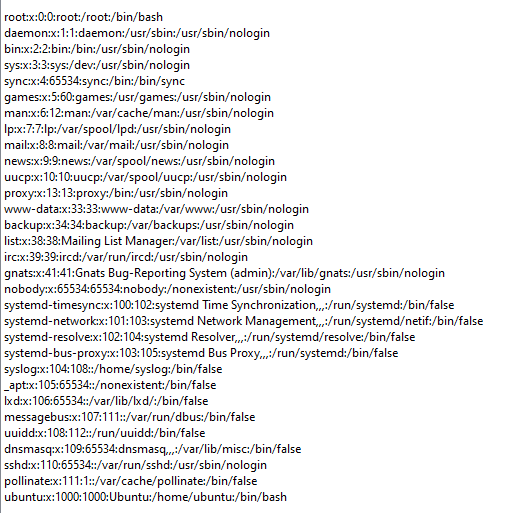
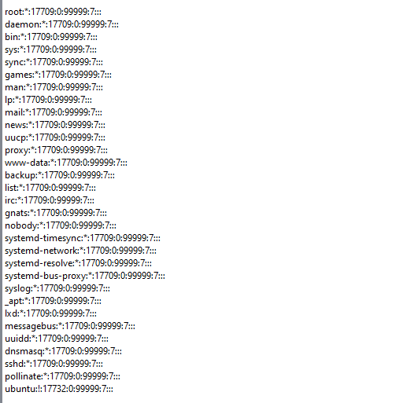
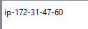
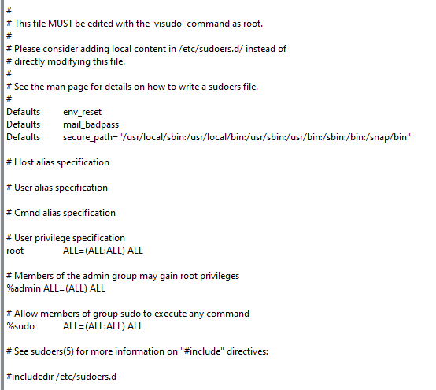
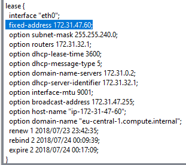

# Análisis del disco

## 1. Información del Sistema y Configuración:

- `/etc/passwd`

SHA-256: c186d3bdf3b416c05224972a46716095cce01ea54877d9d0bd2201afe1eb0d84

- `/etc/shadow`

SHA-256:
ec873901be609941716590e5e80a9ca7c9d12cc4f6b11a0ff7a8f33cf11e3e26

- `/etc/hostname`

SHA-256:
fcae3646e907ca97bb1f9781335a9dd4be910a0d4a8c0784de9d17205b68748c

- `/etc/sudoers`

SHA-256:
9dd478d87554b22953bd54cb013fe5c33b9fbc66760c999d7dbfa79c02c0b5a5

- `/var/lib/`

SHA-256:
ec873901be609941716590e5e80a9ca7c9d12cc4f6b11a0ff7a8f33cf11e3e26

