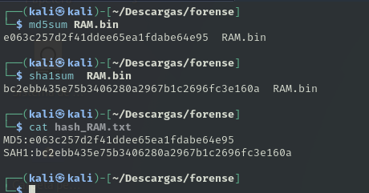

# Informe de Análisis de Memoria RAM

## Comprobación de hash

Calcularemos el hash de la memoria que nos proporcionan y la comparamos con los hashes que nos dan. Con esto aseguramos la integridad de la evidencia.



## Hallazgos encontrados en la memoria

### Procesos

La salida completa de los procesos activos podremos verlo en el [Anexo](Anexo.md)

Podemos ver procesos interesantes como la conexión de un usuario con UID 1000 a traves de ssh.

```
0x88003bd8c4c0.01340    1340    1tackingsshd    0       0       0       0       2018-07-20 09:10:37.096384 UTC  Disabled
0x8800366f6e00  9055    9055    1340    sshd    0       0       0       0       2018-07-24 05:24:16.058132 UTC  Disabled
0x880022833700  9118    9118    9055    sshd    1000    1000    1000    1000    2018-07-24 05:24:18.705764 UTC  Disabled
```

Numerosos procesos de apache.

```
0x88000348ee00.027428   27428   1tackingapache2 0       0       0       0       2018-07-20 10:04:02.724797 UTC  Disabled
0x880036fd8dc0  5573    5573    27428   apache2 33      33      33      33      2018-07-23 06:25:02.027052 UTC  Disabled
0x880036f91b80  5763    5763    27428   apache2 33      33      33      33      2018-07-23 06:50:13.697322 UTC  Disabled
0x88003c975280  6196    6196    27428   apache2 33      33      33      33      2018-07-23 10:26:46.767477 UTC  Disabled
0x88000348a940  6262    6262    27428   apache2 33      33      33      33      2018-07-23 10:51:35.362918 UTC  Disabled
0x88000348e040  6266    6266    27428   apache2 33      33      33      33      2018-07-23 10:51:54.387685 UTC  Disabled
0x8800366f6040  6281    6281    27428   apache2 33      33      33      33      2018-07-23 11:08:42.512891 UTC  Disabled
0x8800366f44c0  6285    6285    27428   apache2 33      33      33      33      2018-07-23 11:08:44.517880 UTC  Disabled
0x8800366f2940  6286    6286    27428   apache2 33      33      33      33      2018-07-23 11:08:44.518256 UTC  Disabled
0x880036f96040  6287    6287    27428   apache2 33      33      33      33      2018-07-23 11:08:44.518570 UTC  Disabled
0x8800366f5280  9054    9054    27428   apache2 33      33      33      33      2018-07-24 05:18:49.670230 UTC  Disabled
```

### Comandos de consola
La salida completa de los comandos podremos verlo en el [Anexo](Anexo.md)
En resumen podemos ver como se realiza una instalación y configuración de un servidor web con diferentes servicios.

Podemos destacar el uso de comandos de edición de archivos de configuración. Esto puede hacernos sospechar de posibles modificicaciones en algunas configuraciones.

```
9126ressbash00.02018-07-24 05:24:19.000000 UTCptsudo vi 000-default.conf 
9126    bash    2018-07-24 05:24:19.000000 UTC  sudo vi ../apache2.conf 
9126    bash    2018-07-24 05:24:19.000000 UTC  sudo vi ../ports.conf 
9126    bash    2018-07-24 05:24:19.000000 UTC  sudo vi /etc/apache2/sites-available/000-default.conf 
9126    bash    2018-07-24 05:24:19.000000 UTC  sudo vi /etc/apache2/sites-enabled/000-default-le-ssl.conf 
9126    bash    2018-07-24 05:24:19.000000 UTC  sudo vi /etc/apache2/sites-enabled/000-default-le-ssl.conf 
9126    bash    2018-07-24 05:24:19.000000 UTC  sudo vi /etc/apache2/sites-enabled/000-default-le-ssl.conf 
9126    bash    2018-07-24 05:24:19.000000 UTC  sudo vi /etc/apache2/sites-enabled/000-default-le-ssl.conf 
9126    bash    2018-07-24 05:24:19.000000 UTC  sudo vi /etc/apache2/sites-enabled/000-default-le-ssl.conf 
9126    bash    2018-07-24 05:24:19.000000 UTC  sudo vi /etc/apache2/sites-enabled/000-default-le-ssl.conf 
```

Parece estar utilizando la herramienta letsencrypt para generar un certificado SSL para el dominio ganga.site y su subdominio www.ganga.site. El uso de Let's Encrypt es bastante común para obtener certificados SSL gratuitos.

```
9126ressbash00.02018-07-24 05:24:19.000000 UTCptsudo letsencrypt --authenticator webroot --installer apache --webroot-path /var/www/html -d ganga.site -d www.ganga.site
9126    bash    2018-07-24 05:24:19.000000 UTC  sudo letsencrypt --authenticator webroot --installer apache --webroot-path /var/www/html -d ganga.site -d www.ganga.site
9126    bash    2018-07-24 05:24:19.000000 UTC  sudo letsencrypt --authenticator webroot --installer apache --webroot-path /var/www/html -d ganga.site -d www.ganga.site
9126    bash    2018-07-24 05:24:19.000000 UTC  sudo letsencrypt --apache -d ganga.site -d www.ganga.site
9126    bash    2018-07-24 05:24:19.000000 UTC  sudo apt-get install python-letsencrypt-apache
9126    bash    2018-07-24 05:24:19.000000 UTC  sudo letsencrypt --apache -d ganga.site -d www.ganga.site
9126    bash    2018-07-24 05:24:19.000000 UTC  letsencrypt
9126    bash    2018-07-24 05:24:19.000000 UTC  sudo letsencrypt --apache -d ganga.site -d www.ganga.site
9126    bash    2018-07-24 05:24:19.000000 UTC  sudo apt install letsencrypt
```

### Código malicioso

Encontramos la detección de código malicioso en un proceso de apache el cuál tiene permsiso de rwx(lectura, escritura y ejecución). Esto puede ser un código malicioso que esta intentando ejecutarse en el sistema. 

```
─$ python3 ./volatility3/vol.py -f RAM.bin --single-location=file://$(pwd)/RAM.bin linux.malfind.Malfind                         
Volatility 3 Framework 2.26.1
Progress:  100.00               Stacking attempts finished                 
PID     Process Start   End     Path    Protection      Hexdump Disasm

5573    apache2 0x7f0663ff3000  0x7f0664033000  Anonymous Mapping       rwx
b8 17 00 00 00 00 00 00 00 00 00 00 00 00 00 00 ................
53 41 57 41 56 41 55 55 48 8b df 48 81 ec 20 01 SAWAVAUUH..H.. .
00 00 48 8b 43 10 48 83 e8 01 48 8d 74 24 38 48 ..H.C.H...H.t$8H
c7 c1 11 00 00 00 48 89 46 08 48 8d 76 08 48 83 ......H.F.H.v.H.
0x7f0663ff3000: mov     eax, 0x17
0x7f0663ff3005: add     byte ptr [rax], al
0x7f0663ff3007: add     byte ptr [rax], al
0x7f0663ff3009: add     byte ptr [rax], al
0x7f0663ff300b: add     byte ptr [rax], al
0x7f0663ff300d: add     byte ptr [rax], al
0x7f0663ff300f: add     byte ptr [rbx + 0x41], dl
0x7f0663ff3012: push    rdi
0x7f0663ff3013: push    r14
0x7f0663ff3015: push    r13
0x7f0663ff3017: push    rbp
0x7f0663ff3018: mov     rbx, rdi
0x7f0663ff301b: sub     rsp, 0x120
0x7f0663ff3022: mov     rax, qword ptr [rbx + 0x10]
0x7f0663ff3026: sub     rax, 1
0x7f0663ff302a: lea     rsi, [rsp + 0x38]
0x7f0663ff302f: mov     rcx, 0x11
0x7f0663ff3036: mov     qword ptr [rsi + 8], rax
0x7f0663ff303a: lea     rsi, [rsi + 8]
```

### Interfaces de red

Podemos ver las interfaces que tenia operativas el sistema operativo, podemos ver 2 una la de localhost y otra eth0 con la IP 172.31.47.60.

```
NetNS   Index   Interface       MAC     Promiscuous     IP      Prefix  Scope Type      State

4026531993      1       lo      00:00:00:00:00:00       False   127.0.0.1       8       host    UNKNOWN
4026531993      1       lo      00:00:00:00:00:00       False   ::1     128     host    UNKNOWN
4026531993      2       eth0    06:1d:7a:bb:a9:04       False   172.31.47.60    20      global  UP
4026531993      2       eth0    06:1d:7a:bb:a9:04       False   fe80::41d:7aff:febb:a904        64      link    UP
```

### Sockstat

Con este comando podremos investigar sobre los diferentes intentos de conexión que ha habido en el sistema.
La salida completa del sockstat podremos verla en el [Anexo](Anexo.md)

A recalcar vemos esta línea en la que se comenta que a través de ssh se hace una conexión de la IP antes comentada a la IP externa 23.226.128.37.
```
4026531993      sshd    9055    9055    3       0x8800367e1680  AF_INET STREAM  TCP     172.31.47.60    22      23.226.128.37   42760   ESTABLISHED     -
```

## Búsquedas con string

Una vez hemos añadido la única información interesante que he podido sacar con los comandos de volatility procedo a investigar con strings información relacionada con los datos que ya hemos obtenido. 

### Nombre de usuario

Haciendo una búsqueda en string con el UID del usuario que nos aparecía encontramos las siguientes lineas: 
```
Jul 20 09:10:35 ip-172-31-47-60 useradd[1111]: new group: name=ubuntu, GID=1000
Jul 20 09:10:35 ip-172-31-47-60 useradd[1111]: new user: name=ubuntu, UID=1000, GID=1000, home=/home/ubuntu, shell=/bin/bash
```
Podemos ver la fecha en la que se registro el usuario y su nombre el cuál es "ubuntu".

### Comprobar conexiones SSH

Si hacemos un grep por el servicio ssh y le añadido la IP 172.31.47.60, hemos encontrado la siguiente conexión.

```
Jul 20 09:35:47 ip-172-31-47-60 sshd[26368]: Accepted publickey for ubuntu from 23.226.128.37 port 39256 ssh2: RSA SHA256:Q27pW6dDYPJ8N0mBX6L8SO8OQ7LVSdNdm1xxzyBT23Y
Jul 20 09:35:47 ip-172-31-47-60 sshd[26368]: pam_unix(sshd:session): session opened for user ubuntu by (uid=0)
```

Vemos cuando fué la primera conexión con la IP que encontramos y que se realiza a través de una clave pública RSA SHA256:Q27pW6dDYPJ8N0mBX6L8SO8OQ7LVSdNdm1xxzyBT23Y.
