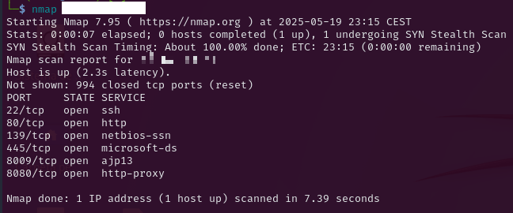

# Basic Pentesting

Lo primero que haremos será hacer un escaneo de puertos a la máquina. Podemos ver puertos interesantes así que vamos a investigar.

Vamos a conectarnos al puerto 80 a ver su hay alguna web interesante. Vemos que la pone que la página está en mantenimiento.

Vamos a comprobar si hay directorios que no veamos a simple vista en la página. Para ello utilizamos la aplicación `gobuster`y nos ha encontrado el directorio `/development`.

Vamos a conectarnos a ver que hay en ese directorio. Nos aparecen 2 archivos .txt en el directorio.

- `dev.txt`: Parece una conversación entre dos personas en la que se habla de una versión de una página web de Apache.

- `j.txt`: En este archivo parece que J le deja a K un mensaje de que en el archivo /etc/shadow hay contraseñas inseguras.

Buscamos la vulnerabilidad en google a ver si hay algún exploit conocido.

Hemos encontrado esta vulnerabilidad la cuál tiene un CVE.

Vamos a buscar en metaexploit el CVE para ver si hay algún módulo relacionado con el exploit. Parece ser que si hay un módulo disponible.

Seleccionamos el módulo y vemos que opciones tiene. Hay opciones que no tenemos como el `TARGETURE`, por lo que no podemos ejecutar el exploit.

Vamos a probar a ver por otro servicio. Vimos que estaba abierto el puerto 139 el cuál esta relacionado con SMB. Vamos a ver si podemos enumerar las carpetas a ver si tenemos acceso anonimo.
Esto podemos hacerlo con el comando `smbclient -L IP`, con el que vemos que tenemos la carpeta `Anonymous`.

Probamos a conectarnos a la carpeta a ver si hay algo interesante dentro.
Nos deja conectarnos y al listar los archivos encontramos el archivo `staff.txt` por lo que vamos a extraerlo y mirarlo.

`staff.txt`: deja un mensaje sobre que no utilicen las carpetas compartidas para hacer gracias debido a que es lo que puede generar errores. Este mensaje se lo recalca al usuario llamado Jan el cuál podría ser un usuario del sistema.

Vamos a ejecutar el comando `enum4linux` para listar información del SMB.

En uno de los apartados nos salen usuarios del sistema. Con ello corroboramos que uno de los usuarios es `jan` y hay otro usuario llamado `kay`.

Una vez que sabemos usuarios del sistema vamos a intertar acceder con hydra a través de fuerza bruta por el puerto 22 (SSH).
El resultado es que hemos descubierto la contraseña del usuario jan.

Vamos a acceder con los credenciales que hemos conseguido y vemos como ya estamos dentro del sistema como usuario jan.

Vamos a ver si encontramos algún archivo interesante. No vemos nada intersante pero vemos que también esta el directorio del usuario kay, pero no tenemos permisos para acceder.

Nos recomiendan que utilicemos la herramienta `LinEnum`, en este repositorio está el script que utiliza la herramienta.

Nos hemos descargado el script y ahora quiero pasarlo a la máquina, por lo que utilizare para esto el comando `scp` y lo guardaremos en /tmp que no hace falta permisos.

Aquí vemos un ls antes y despúes de ejecutar el comando y vemos que nos hemos pasado el archivo.

Ejecutaremos el script en la máquina y nos hará un escaneo completo. Vemos como en ficheros interesantes nos ha encontrado `/home/kay/pass.bak` el cuál no tenemos permisos para leerlo. También nos mencionan `/home/kay/.bash_history`.

Buscamos el archivo.

Vemos que no tenemos permisos para leerlo. Pero en la foto de antes podemos ver el directorio `.ssh` en el cuál se suelen guardar las claves para conectarse por ssh del usuario.

Vamos a probar a entrar y vemos que esta el archivo `id_rsa` el cuál es donde se aloja la private key. Vemos si podemos ver el fichero y si que nos deja ver su contenido.

El contenido de este fichero lo copiaremos y lo pegaremos en un .txt . De este txt sacaremos su hash para ver si con la herramienta JohnRipper podemos hacerle fuerza bruta.

Ejecutamos el comando y nos encuentra la palabra que utilizo para crear la clave privada el usuario.

Una vez descubierto la password, nos metemos por el ssh de nuevo con el usuario jan. Ya dentro nos conectaremos por ssh al usuario kay con el archivo `id_rsa`.

Al ejecutar el comando nos pedirá que pongamos la contraseña que hemos decodificado anteriormente. Después de ponerla tendremos acceso al sistema con el usuario `kay`.

Y ya podríamos ver la clave del archivo que no podiamos ver antes debido a la falta de permisos.

