# Blue

Haremos un escaneo a la máquina para ver que puertos tiene abiertos: 

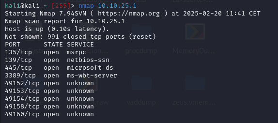

Ya hemos visto que puertos tiene abiertos. Ahora vamos a hacer un escaneo de las versiones y detectar vulnerabilidades. Esto lo haremos con `nmap -sV --script vuln "IP"`
Con -**sV** detectamos las versiones de los puertos abiertos y con **--script vuln** le ejecutamos un script de vulnerabilidades de nmap conocidas. 

Una vez acaba de ejecutarse al final nos da un resumen de los resultados que ha encontrado. Aqui nos dice que ha encontrado una vulnerabilidad relacionada con SMB y nos da su CVE y su ms. 

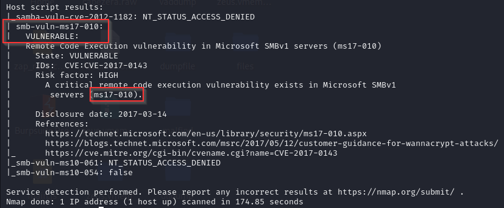

Iniciamos metaexploit y buscamos la vulnerabilidad encontrada. Con este comando nos dará la ruta del exploit. 

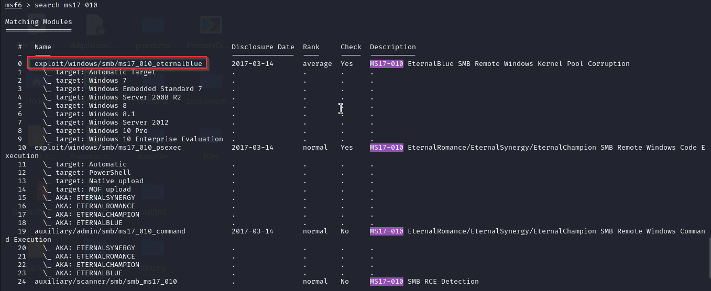

Seleccionaremos el exploit 

Con `show options` podemos ver que opciones nos deja configurar el exploit. 

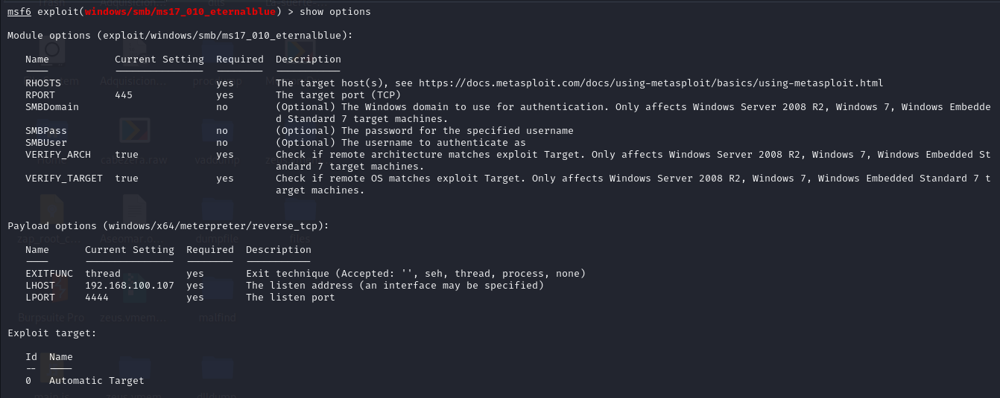

Aquí podemos ver los diferentes parámetros que podemos editar para ejecutar el exploit. Nosotros tendremos que configurar **RHOST** (IP del objetivo), **RPOT** (Puerto del objetivo, dejaremos el que tiene por defecto), **LHOST** (IP atacante) y **LPORT** (puerto del atacante, dejaremos el predeterminado). 

Editamos los parametros y vemos que se hayan configurado.
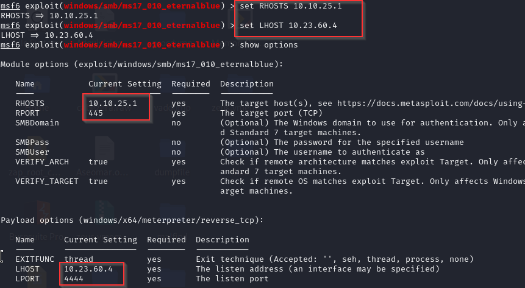

Y agregamos un payload de shell reverse.

Una vez configurado todo ejecutamos el exploit con `exploit`.

Si funciona correctamente nos meterá en la consola del sistema.

Nos dicen que dejemos 

Nos piden que investiguemos como convertir un shell en un shell de meterpreter en metaexploir. 

En esta página nos explican como convertir la shell para meterpreter: [Enlace guía](https://docs.metasploit.com/docs/pentesting/metasploit-guide-upgrading-shells-to-meterpreter.html)

Miramos las sessiones.

Nos dicen que usemos `use multi/manage/shell_to_meterpreter` donde podremos ver la ruta del exploit (post/multi/manage/shell_to_meterpreter).

Vemos las opciones que nos deja seleccionar.

Editaremos LHOST (nuestra IP) y SESSION (id de la session que vimos antes), ya que LPORT lo dejaremos el que está por defecto. 

Y ejecutamos el exploit. 

Nos dice que se ha creado el meterpreter en la session 2 por lo que vamos a comprobarlo. 

. 

Nos conectaremos a la sessions creada. 

Una vez conectados dice que ejecutemos el comando `getsystem` y comporbemos que hemos escalado a SYSTEM.

Nos dicen que ejecutemos una shell y ejecutemos whoami para ver si somos el sistema. 
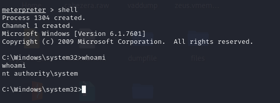

Con permisos del sistema podemos ejecutar el comando hashdump. Vemos que nos sale el usuario Jon creado. 

Podemos probar a descifrar la contraseña. 

La cogeremos y con `hashid` identificaremos en que esta hasheada la contraseña. 

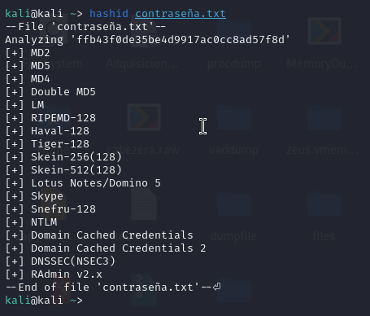

Probamos a desencriptar con los diferentes formatos de hash con John Ripper. Y tenemos que la contraseña es **alqfna22**. 

Por último nos tenemos que encontrar la 3 flag, por lo que buscaremos en los directorios de la máquina.

La primera nos dicen que se encuentra en la raiz del sistema. Vemos el fichero **flag1.txt**. 

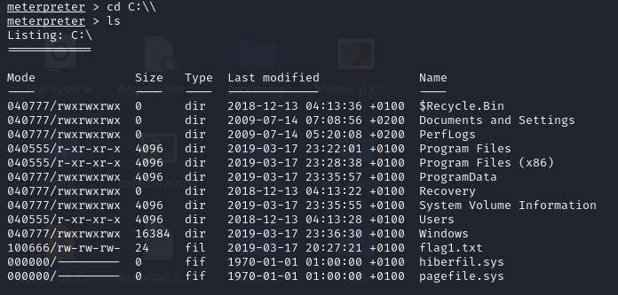

Vamos a ver que hay dentro del fichero y encontramos la primera flag. 

La segunda flag nos dicen que se encuentra en un sitio nos dicen que está en una carpeta de configuración de Windows. Por lo que nos metemos en System32 y haremos un grep a ver si encontramos el fichero. 

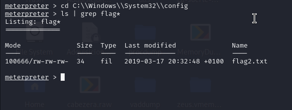

Una vez encontrado miraremos el contenido del mismo. 

Nos dicen que esta en una carpeta de uno de los administradores del sistema. Jon es el único usuario creado por lo que pensamos que es el usuario que se creo en la instalación del SO y por lo tanto es el que tiene permisos de administrador. 

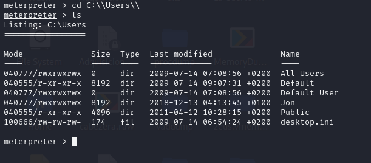

Entramos en us carpeta y listamos sus directorios. 

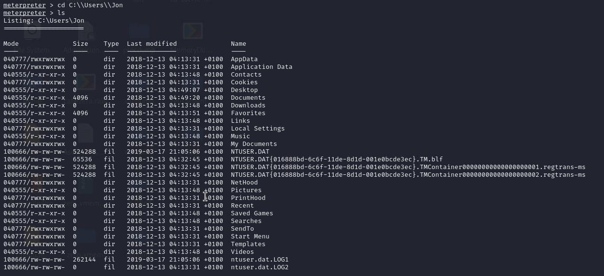

Vamos mirando en Downloads a ver si vemos algo pero no hay nada.

Podemos ver como dentro de Documents hay un archivo flag3.txt
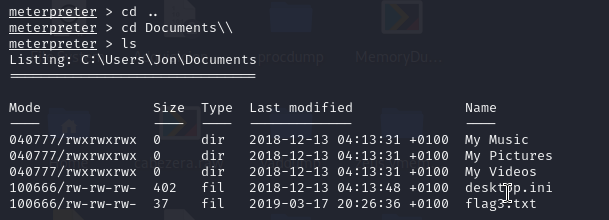

Vamos a listar el contenido del fichero y localizamos la tercera flag. 

1. flag{access_the_machine}
2. flag{sam_database_elevated_access}
3. flag{admin_documents_can_be_valuable}