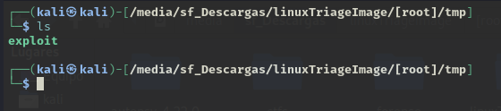
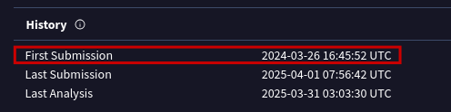
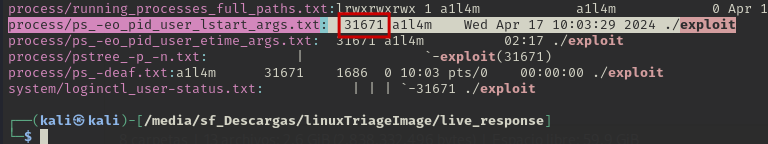
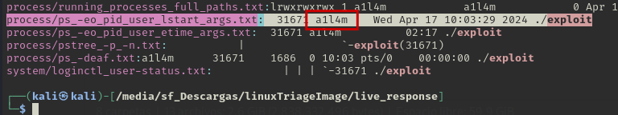
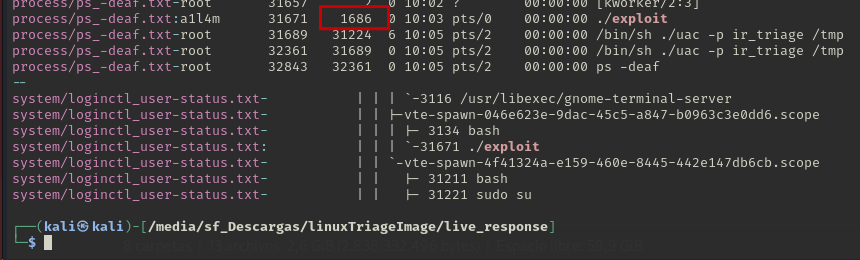
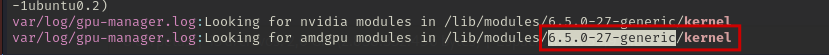
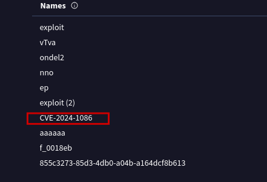

Preguntas
1. ¿Cuál es el nombre del archivo clave que el intruso descargó para escalar privilegios después de obtener acceso no autorizado?

Formato de respuesta: `*******` --> exploit

Normalmente los exploit se descargan en la carpeta /tmp debido a que esta no necesitas permisos de sudo. 

2. ¿Cuándo fue enviado por primera vez a VirusTotal el archivo utilizado para la escalada de privilegios?

Formato de respuesta: `****-**-** **:**:** ***` --> 2024-03-26 16:45:52 UTC 

Si subimos el exploit a Virus Total, en el historial nos aparece la primera fecha en la que se subió.

3. ¿Cuál es el ID de proceso (PID) de la operación lanzada por el atacante?

Formato de respuesta: `*****` --> 31671

UAC nos genera una carpeta llamada `live_response` en la cuál salen registros del sistema. Vamos a utilizar grep para buscar procesos relacionados con el nombre del exploit que encontramos en el /tmp.

4. ¿Con qué nombre de usuario se estaba ejecutando el proceso malicioso?

Formato de respuesta: `*****` --> a1l4m

En la misma fotografía podemos ver como aparece el usuario que lo ejecuta.

 

5. ¿Cuál es el ID de proceso padre (PPID) asociado al proceso malicioso?

Formato de respuesta: `****` --> 1686

6. ¿Cuál es el sistema operativo y su versión en el servidor comprometido?

Formato de respuesta: `**.**.*-******` --> 22.04.1-Ubuntu

Si usamos grep en live_response buscando la versión de Ubuntu vemos que nos aparece la versión.

7. ¿Cuál es la versión del kernel del sistema comprometido?

Formato de respuesta: `*.*.*-**-*******` --> 6.5.0-27-generic

Buscaremos en la carpeta con grep por kernel. Vemos como en uno de los registros nos sale el kernel.

8. ¿Cuál es el número de CVE más reciente asociado a las vulnerabilidades explotadas en este ataque?

Formato de respuesta: `***-****-****` --> CVE-2024-1086

Hemos buscado el exploit en Virus Total y nos sale el siguiente CVE.

