# Anthem

Lo primero que haremos será hacerle un nmap a la máquina. 
Antes hemos comprobado si nos hacía ping a la máquna y vemos que no.

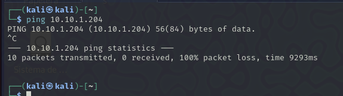

Debido a esto haremos nmap con -Pn. 

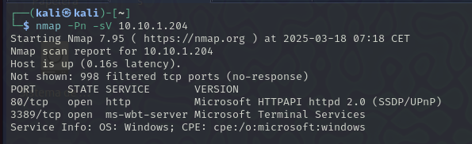

Podemos ver 2 puertos el 80 que será una página web y el 3389 el cuaĺ es el puerto del RDP de WIndows. 

Vamos a entrar en la web.

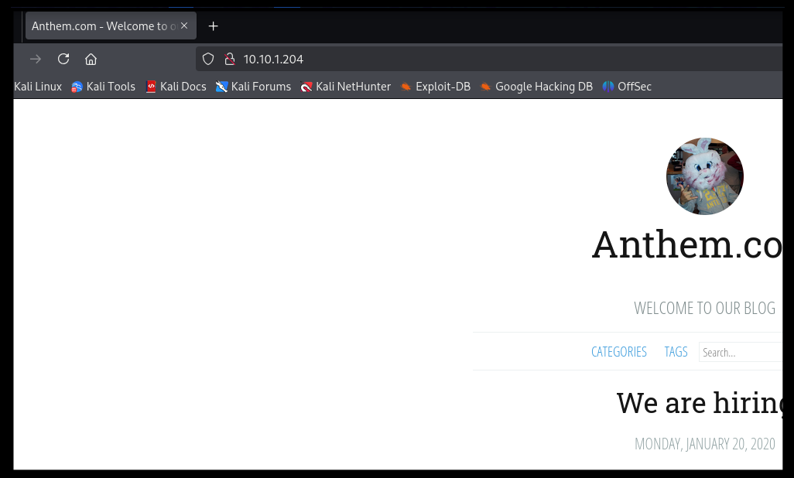

Nos apararecen 2 artículos en el blog. Vamos a entrar en los dos a ver si podemos encontrar algo. 
Hemos estado investigando y en uno de los post hay un comentario de un usuario. 

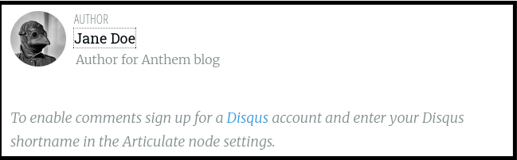

Y encontramos una flag debajo del titulo de un post que subió. 

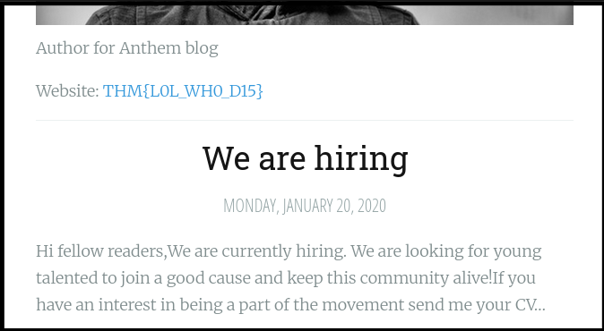

THM{L0L_WH0_D15}

Viendo el código de la página vemos otra flag comentada. 

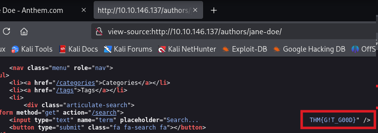

THM{G!T_G00D}

Vemos otra en otro encabezado

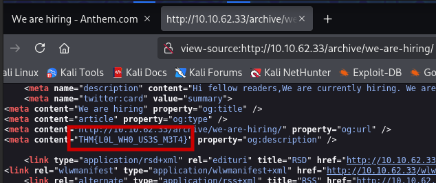

THM{L0L_WH0_US3S_M3T4}

Vamos a mirar todos los codigos de las páginas por si encontramos alguna otra flag:

En el segundo blog podemos ver en el código una flag que la verdad esta bastante escondida. Le pase el codigo al chat y me detecto la flag. 

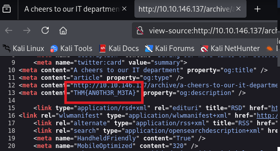

THM{AN0TH3R_M3TA}

Vamos a mirar en los directorios más típicos de las páginas webs. 

- robots.txt

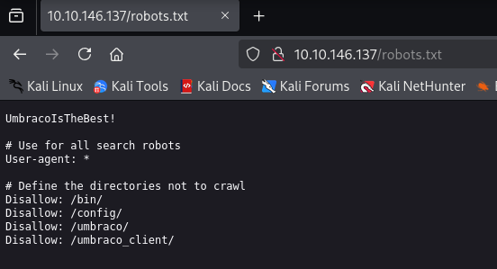

Nos aparece la siguinete información donde vemos directorios de umbraco. Buscamos que es umbraco y vemos que es un CMS por lo que la página esta creada con este CMS.

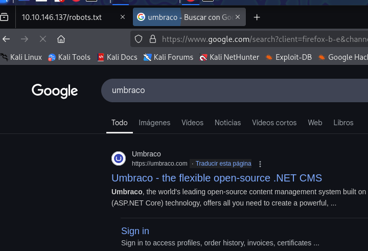

Lo primero que nos sale es UmbracoIsTheBest!, puede ser una contraseña con que vamos a guardarla. 

Ahora vamos a meternos en todos los directorios que nos sale en el robots.txt a ver si encontramos algo. 

No hay nada

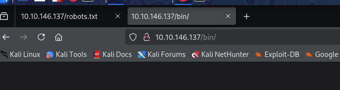

Solo nos redirige a la página principal

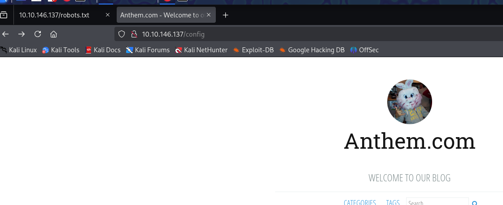

Si accedemos a /umbraco/ nos redirige a lo que parece un login del cms:
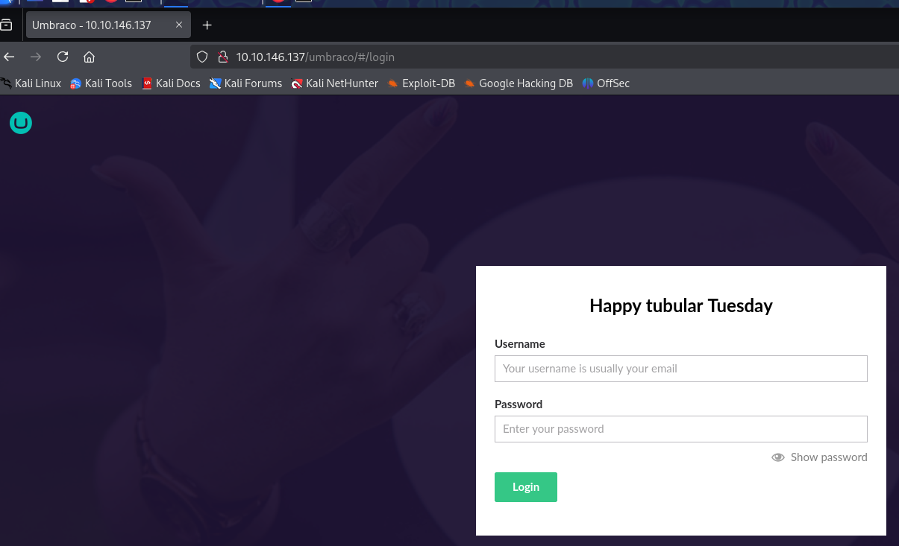

Para el login nos pide usuario o correo y contraseña. La contraseña creemos que es la que salia en robots el usuario tendremos que buscar por la web a ver si hay alguna pista. 

Encontramos en un post este correo: 

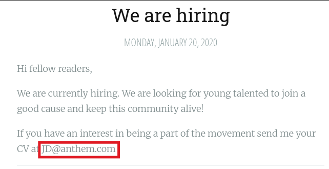

Nos da error. 

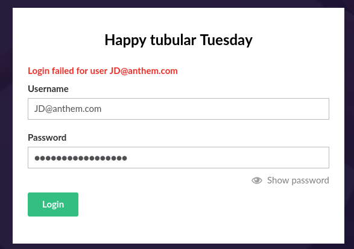

No encuentro nada de ningún correo y he buscado información preguntadole a chat. Me dice que hay concordancia entre el correo que he encontrado y el usuario que ha subido el post. 

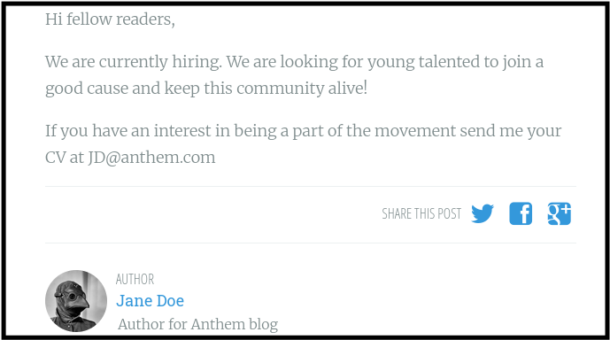

Como vemos el usuario que lo sube se llama Jana Doe y el correo es JD@anthem.com, el correo se forma con las iniciales del usuario.  El tryhackme hay una pregunta que nos decia cuál era el nombre del administrador. 
Buscando un poema que había estaba dedicado al administrador al blog vemos que el creado se llamaba Solomon Grundy por lo que su correo de administrador debería ser igual en cuanto a formato. 

Por esto hemos llegado a que el correo del administrador es **SG@anthem.com**. Vamos a probar a loguearnos ahora.  (Recalco que era demasiado enrevesado y tuve que preguntarle al chat a ver is encontraba alguna manera de hacerlo)

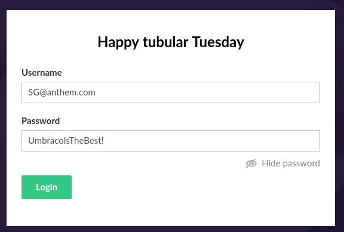

***
Ya que tenemos usuario y contraseña vamos a meternos en el RDP que vimos que tenía abierto el sistema.

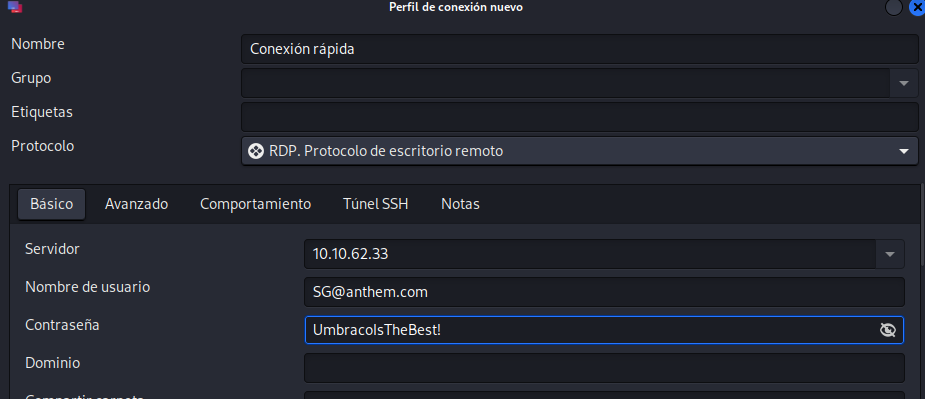

(el usuario es SG no el correo)

Nos aparece un user.txt con una flag

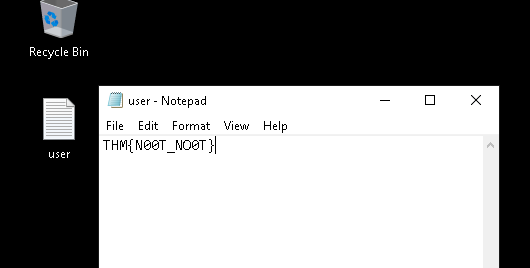

THM nos dice que activemos los archivos y documentos ocultos para poder verlos

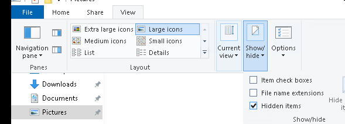

Dentro de backup encontramos un archivo

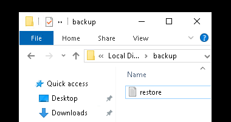

Nos da error de permisos 

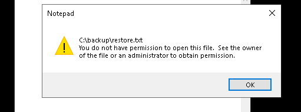

Vemos los permisos y nos sale que no hay usuario con permisos

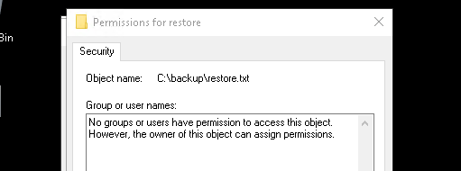

Somos el usuario SG por loq ue vamos a darnos permiso.

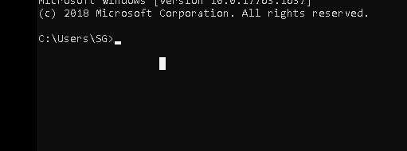

Nos damos permisos 

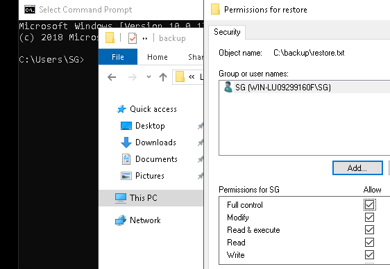

Y encontramos la flag

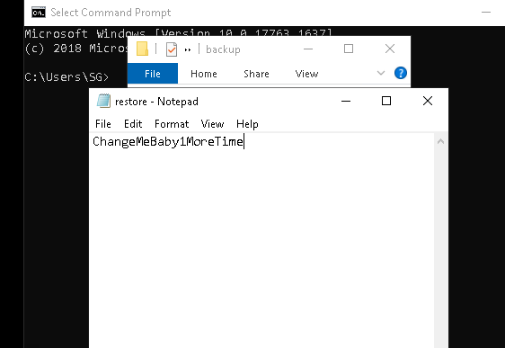