# Blaster

Lo primero que haremos probar la conectividad  máquina, pero vemos que no nos hace ping ni nmap. 

Como nmap lo primero que hace es un ping y hemos visto que no nos deja, usaremos las opciones -Pn para que se salte el ping y nos haga el nmap. Vemos que esta activo el puerto 80 por lo que puede haber una página web. 

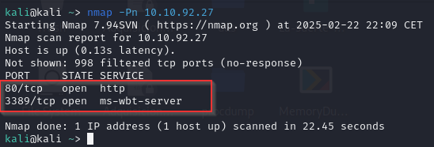

POnemos la IP de la máquina en el buscador y nos conectamos a la máquina. 
 
 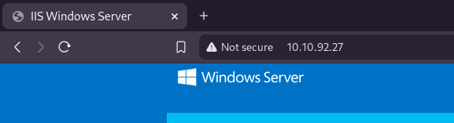

 Vamos a hacer un fuzzeo de la web a ver si encontramos algún directorio interesante con gobuster. Nos localiza el directorio /retro/
 

Entramos al directorio y nos mete en lo que parece un foro.
 

Vemos varios post del usuario Wade. 
 
 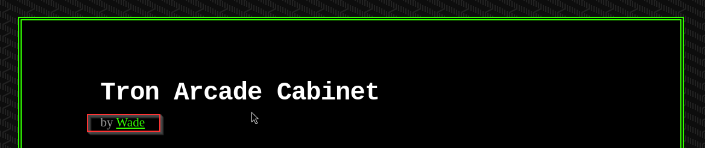
 
 
 En los post recientes vemos un apartado de comentarios recientes. THM nos dice que ahí podemos encontrar información relevante. 
 
 
 
 
 Viendo el comentario podemos que habla que su usuario de sesión será Wade. 
 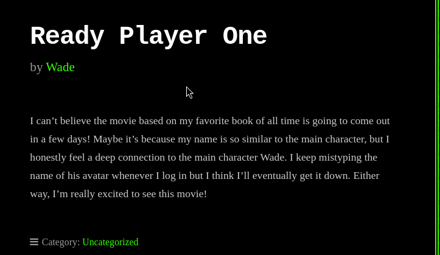

Se responde a si mismo en un comentario donde deja la contraseña del usuario por su se le olvida. 
 
 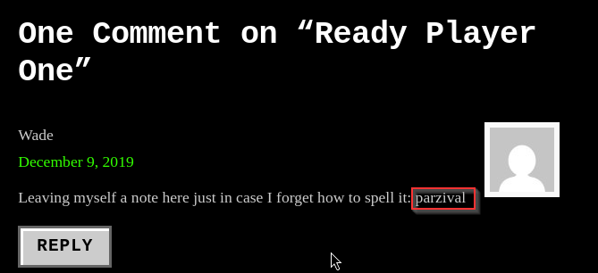

Vamos a probar a conectarnos al sistema operativo a través de RDP ya que en el nmap vimos que estaba el puerto abierto. Probaremos a entrar con los credenciales que hemso encontrado.
Usaremos remmina para el RDP.

Crearemos una nueva sesión con los datos que tenemos. 

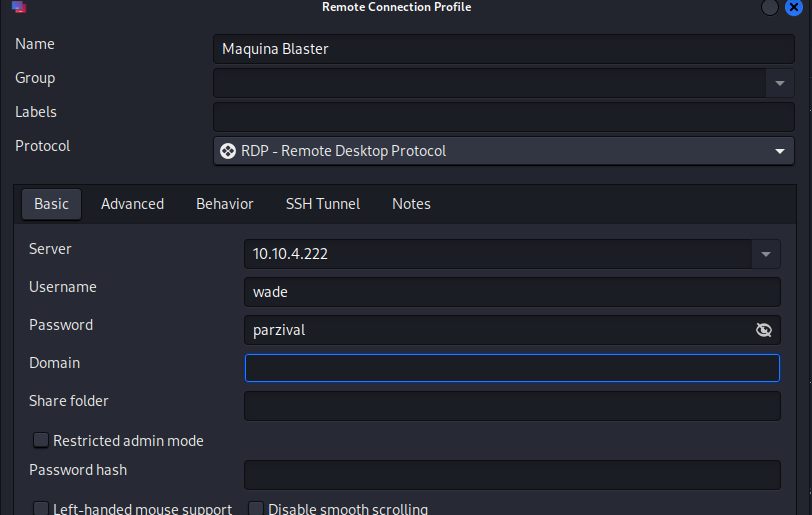

Y ya estamos dentro de la máquina. 

Vemos que hay un archivo user.txt en el escritorio donde encontramos una flag. 

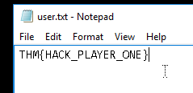  

Flag: THM{HACK_PLAYER_ONE}

Nos dicen que encontremos el CVE que ha buscado el usuario en el historial de explorer. Al parecer no se si es un bug o algo pero no nos aparece nada ni en el histroial ni en los archivos del historial.

En THM nos dicen la solución por lo que vamos a coger la respuesta de ahí.

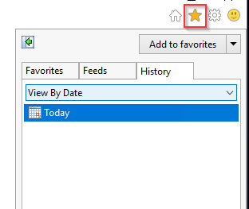

CVE-2019-1388

En el escritorio vemos un archivo hhupd. En THM nos dan un vieo con el que ejecutar un exploit.  

Video: https://www.youtube.com/watch?v=3BQKpPNlTSo

Ejecutamos el script y le damos a "Show more details"

Clickaremos en "Show info about teh publisher's certificate" 

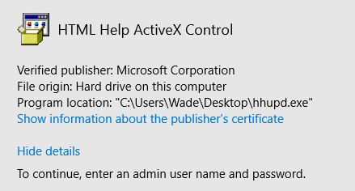

Nos carga el certificado y le damos al enlace que nos aparece en Issued by. 

Al pinchar nos abre explorer una página pero no nos carga. 

Guardaremos la página como un archivo.

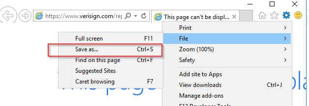

Buscamos la ruta donde se encuentra la cmd.

Aquí podemos verla

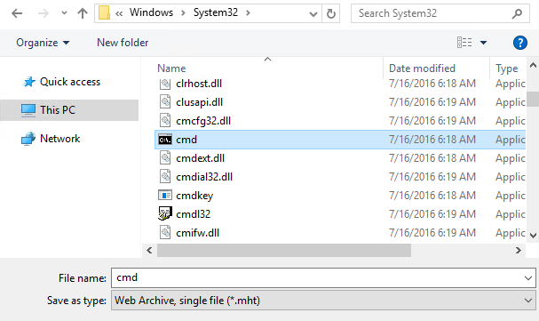

Le daremos click y lo abriremos con la terminal. 

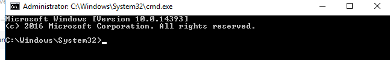

Vamos a verificar que usuario somos. El exploit que hemos ejecutado nos ha permitido abrir la cmd como usuario sistema con loq ue tenemos permisos administrador.

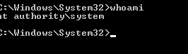

Ahora nos dicen que busquemos la flag en de root.txt del directorio en la carpeta del Administrador.

En el directorio Desktop vemos el archivo que se nos menciona.

Vemos el contenido del fichero para encontrar la flag.

Flag: THM{COIN_OPERATED_EXPLOITATION}

Nos dicen que no cerremos la sesión de la consola. Nos proporcionan el siguiente exploit `exploit/multi/script/web_delivery`, así que lo buscaremos en metaexploit. 

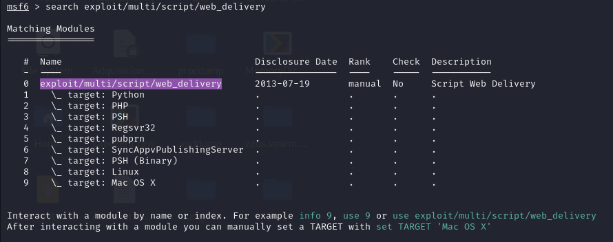

Seleccionaremos el primer exploit.

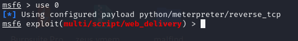

Vemos las opciones de configuración del exploit

Vemos como nos aparece la opción target.

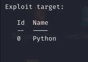

Como vemos arriba la opción por defecto es Python, nosotros escogeremos la opción PSH que es la de PowerShell.

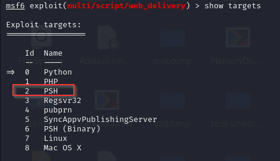

Por lo que seleccionaremos el target 2. 
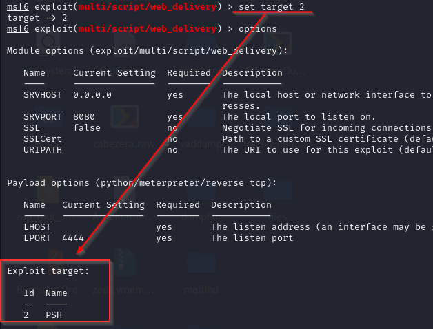

Configuramos LHOST. 
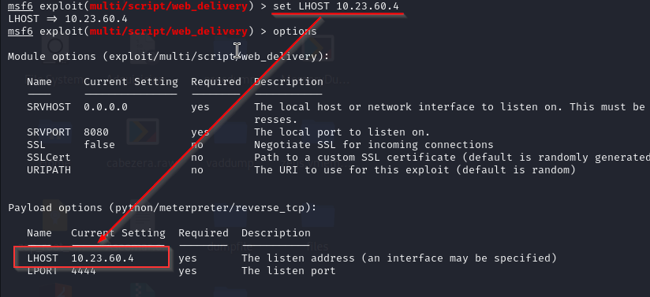

Configuramos el payload con la reserse shell de meterpreter.

Y ejecutamos el exploit. Como podemos ver nis aparece un comando que deberemos de ejecutarlo en la cmd del Windows.
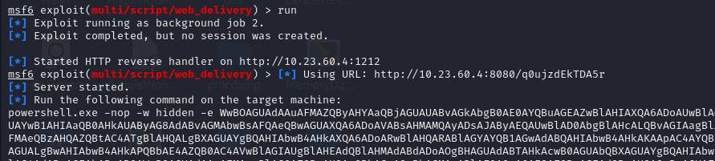

Copiamos el comando que nos dio el exploit en la cmd.

Y ya estariamos dentro del sistema operativo a través de meterpreter. 

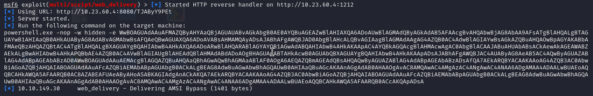
