# Ice

Lo primero que haremos sera un Nmap para ver que puertos tiene abierto la máquina. 

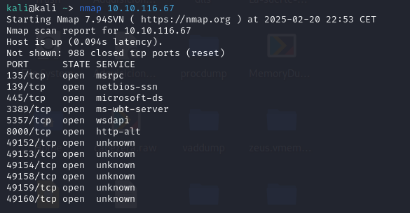

AÑadiendo a nmap -sV -O nos dirá la versión de los servicios y sus sistema operativo. Vemos que hay en el puerto 8000 de http un servicio llamado Icecast. 

Con -sC  podemos ver entre otras cosas el nombre que tiene el ordenador

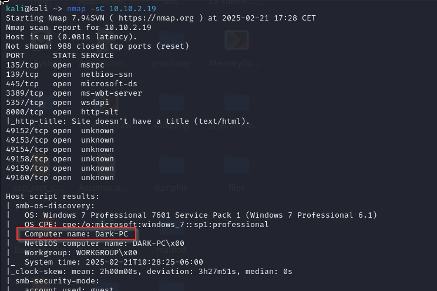

Buscaremos Icecast en [https://www.cvedetails.com](https://www.cvedetails.com) para ver su nivel de impacto. 

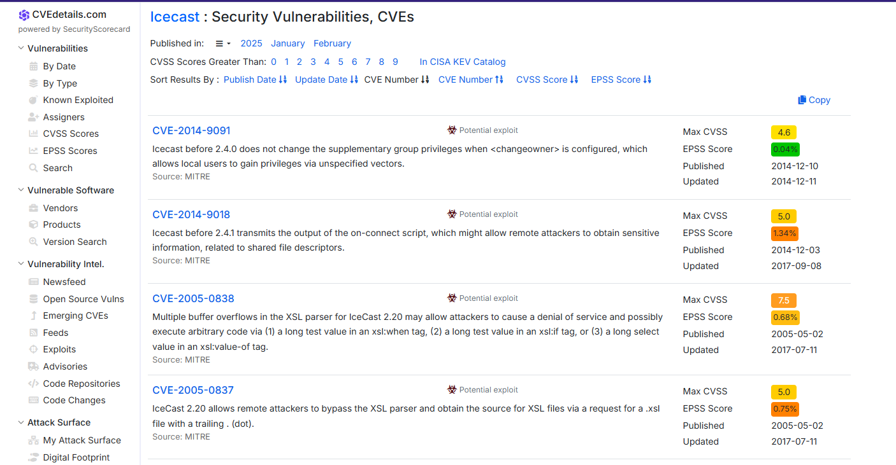

Vemos que tiene una nota de 6.4 de score. 

Si buscamos la versión de icecast encontramso su CVE --> 2004 -1561 

https://www.exploit-db.com/exploits/568

Una vez hemos localizado el CVE de Icecast vamos a utilizar metaexploit para buscar posibles exploit. 

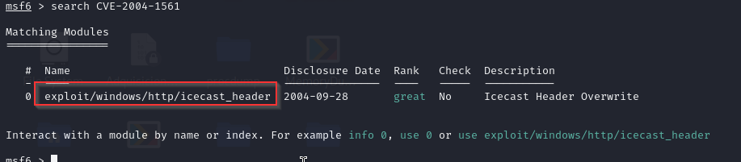

Encontramos uno y lo usamos. 

Editaremos las opciones del exploit. 

Una vez configurada ejecutaremos el exploit. Esto creará una sesión la cuál es una consola remota en el dispositivo objetivo.

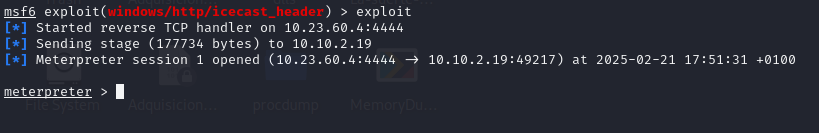

COmprobamos que usuarios somos y que arquitectura tiene el SO. Dejaremos la sesión en segundo plano. 
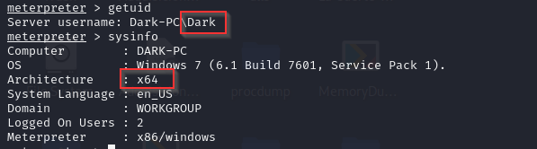

Vamos a ejecutar ahora un exploit para poder escalar privilegios en la sesión que hemos iniciado anteriormente. Buscamos el exploit que nos dice THM y seleccionamos el primero. 

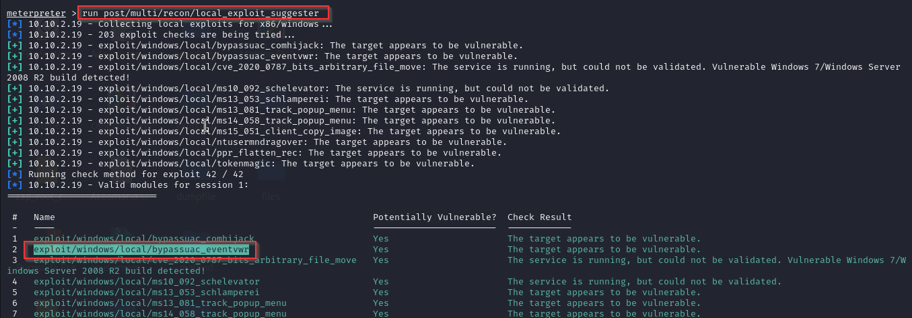

Vemos que opciones tiene para configurar el exploit. 

Modificaremos SESSION y LHOST. 

Una vez configurado ejecutamos el exploit. Esto debería de abrirnos la sesión qu ecreamos antes pero con escala de privilegios.
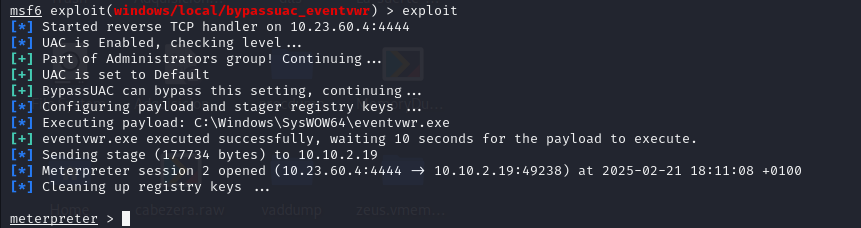

Vemos que privilegios tenemos en la consola. Vemos que tenemos SeTakeOwnershipPrivilege, este permiso otorga control total en todos los arhcivos del sistema pudiendo escribir en ellos o editarlos. 

Listamos los servicios que están activos en el sistema. 

ELegimos un proceso que este ejecutandose por el sistema es decir por NT AUTHORITY\SYSTEM con los que poder ser ese usuario. 

Con migrate -N seleccionamos el proceso a ejecutar. 
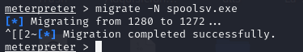

Una vez migrado veremos si hemso cambiado de usuario. Efectivamente somos T AUTHORITY\SYSTEM

Cargaremos la herramienta kiwi en meterpreter, la cuál nos proporciona numerosos comandos. 
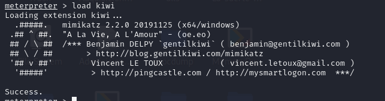

Con creeds_all podemos ver los credenciales parseados. 
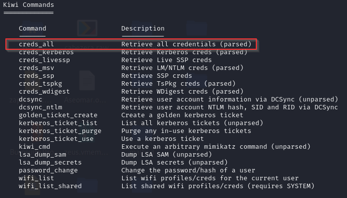
Vemos como encuentra los credenciales del usuario Dark es Password01!

Con el comando hashdump podemos extraer los hashes de las contraseñas de los usuarios de un sistema.

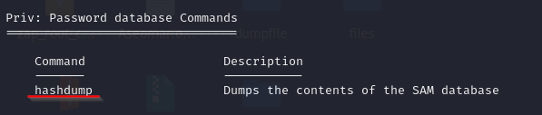

Con el screenshare nos permite transmitir en tiempo real la pantalla del sistema

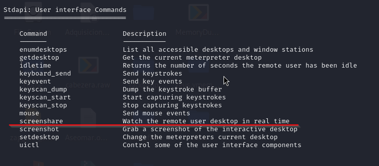

Con record_mic permite grabar audio a través del micrófono del sistema

Con timestomp permite modificar los atributos de tiempo de los archivos en un sistema

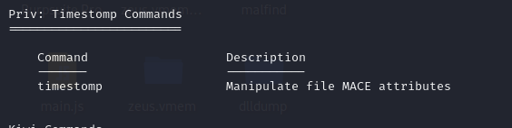

Con golden_tiket_create permite generar un ticket Kerberos dorado

Este exploit permite habilitar el servicio de RDP en la máquina que estamos atacando.

