Hacemos ping a la máquina para probar que tenemos conexión. Miraremos que puertos tiene abiertos con nmap. 
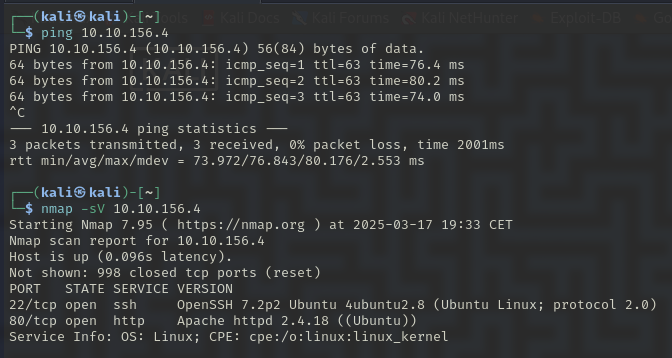

Vemos el 22 y el 80. Vamos a mirar la página web que esta en el puerto 80. 

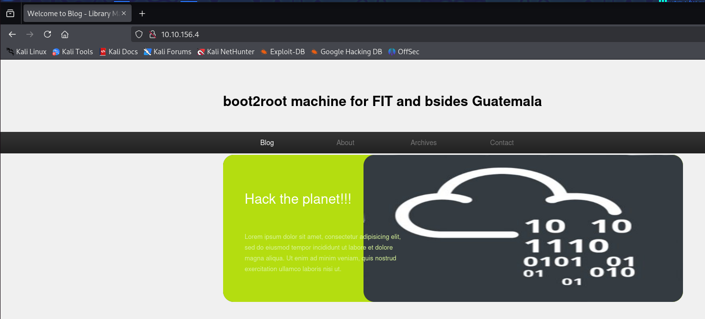

Vamos a probar a hacer un fuzzeo a ver si vemos algún directorio que nos interese. 

Vamos por partes, primero vamos a mirar la página inicial a ver si podemos encontrar algo.

El post que sale en la página nos aparece posteado por meliodas. Este es un posible usuario. 

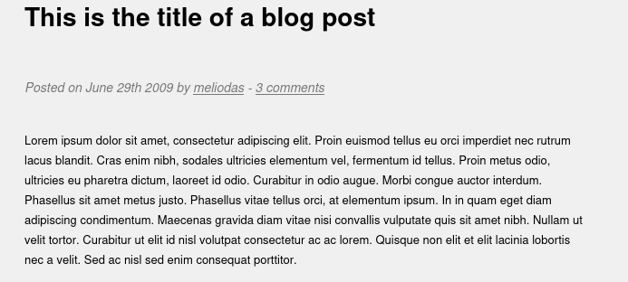

Vemos 3 comentarios en la página, por lo que pueden ser 3 usuarios con los que podamos loguearnos en un futuro aunque aún no tenemos nada. 

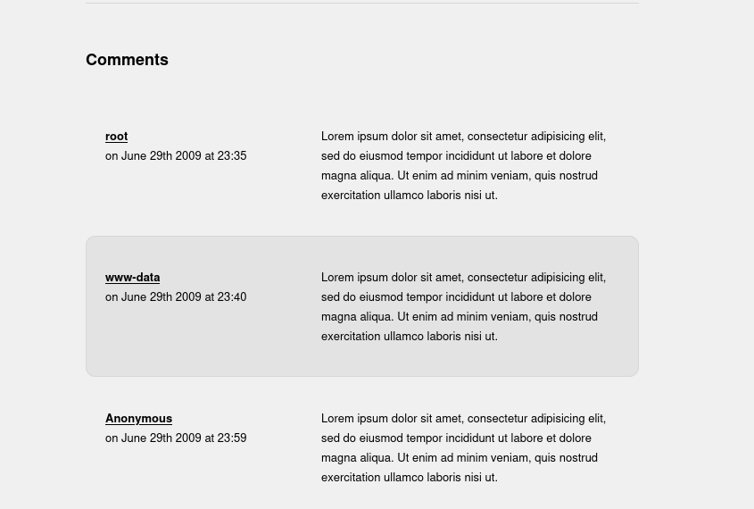

En images no encontramos nada. 

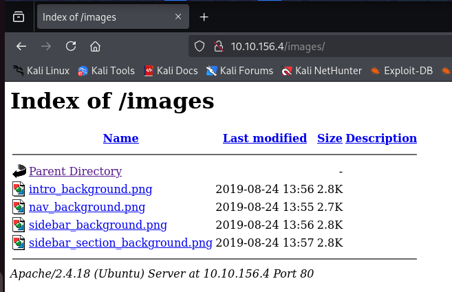

En robots.txt nos reenvia al directorio rockyou. 

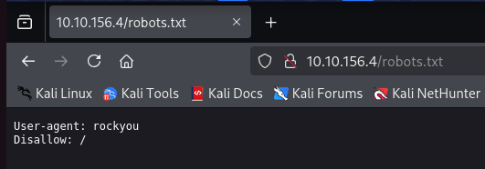

Pero no nos aparece nada
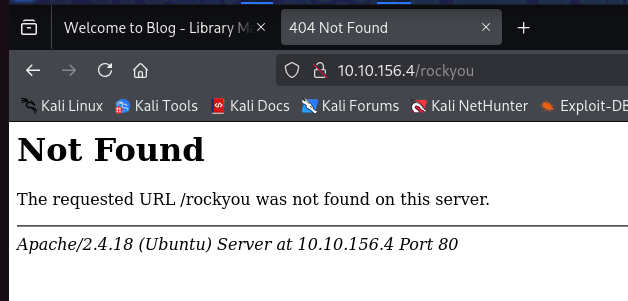

Ya lo unico que nos queda es lo siguiente, hemos visto en el nmap que tenia el ssh en el puerto 22 abierto. Por lo que hemos identificado 4 posibles usuarios a los que poder hacerle fuerza bruta para conseguir la contraseña.
Vamos a probar a hacerlo con hydra. 

Comando del hydran --> `hydra -l usuario -P lista_de_contraseñas servicio://IP -V`

Tenemos los siguientes usuarios: meliodas, root, www-data y Anonymous. Vamos a ello, nosotros lo vamos a hacer sin el -V porque si no nos van a salir todos los intentos y no queremos llenar la terminal de intentos fallidos. 

Con el usuario meliodas parece que nos ha encontrado una contraseña: `iloveyou1`
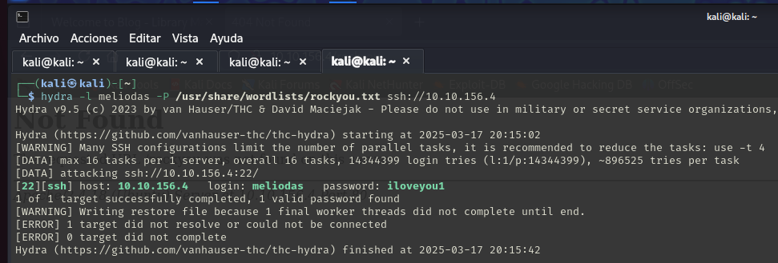

Ya que tenemos usuario y contraseña probamos a conectarnos con ssh: 
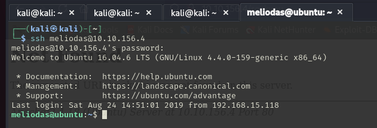

Estamos dentro del sistema. Vamos a ver que permisos tiene el usuario. 
Parece que tenemos permisos para ejecutar el archivo bak.py. 
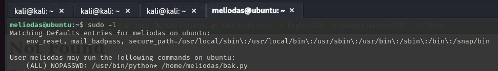

Listamos el directorio y vemos dos archivos el bak.py y el user.txt. 
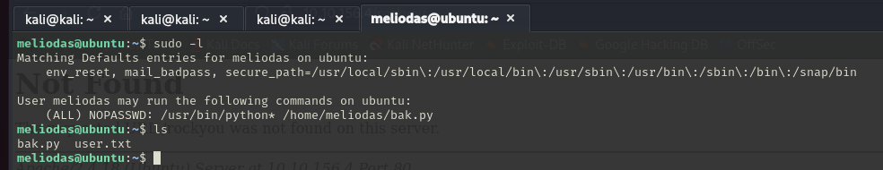

Vamos a ver que hay en user.txt. Vemos la priemra flag. 
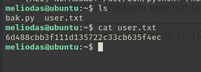

Vamos a ver el contenido del archivo bak.py. Le he preguntado el uso que hace el python a ChatGPT. 
Nos dice que este script parece estar diseñado para crear una copia de seguridad comprimida de un sitio web alojado en el servidor. 
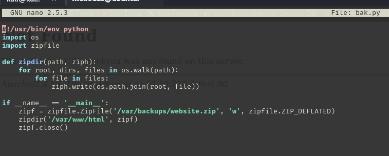

Preguntadole a chat como poder modificarlo, debido a que yo no tengo ni idea de como poder cambiarlo. Y nos propone esta solución alterar el python para abrir una terminal con permisos de root. 
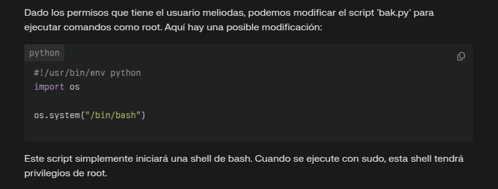

Al editar el archivo nos da error debido a que no tenemos permisos.
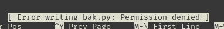
SI nos damos cuenta el archivo esta creado por el root por lo que tendremos que crear uno nosotros con el mismo nombre. Probamos a borrar el archivo pero nos da error de permisos. 
Al ver los permisos del usuario este tiene todos los permisos en su directorio por lo que si utilizamos -f de force con rm funciona. 
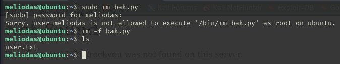

Ahora crearemos un nuevo Python con el contenido que queremos para generar la terminal. 
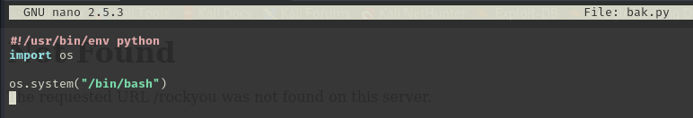

Vemos que se haya creado el archivo de nuevo y vemos de nuevo los permisos que tenemos:
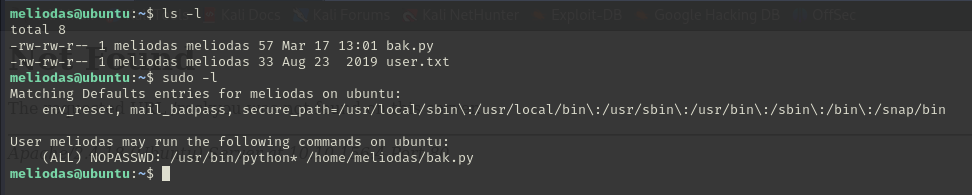

Por los permisos que tenemos ejecutaremos el python con el comando `sudo /usr/bin/python /home/meliodas/bak.py
` . Vemos que nos ha cambiado la cmd a root: 

Ahora que somos usuarios root podemos ver el directorio root. 
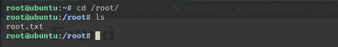

Vemos que hay un root.txt y vemos el interior del archivo.
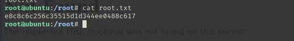