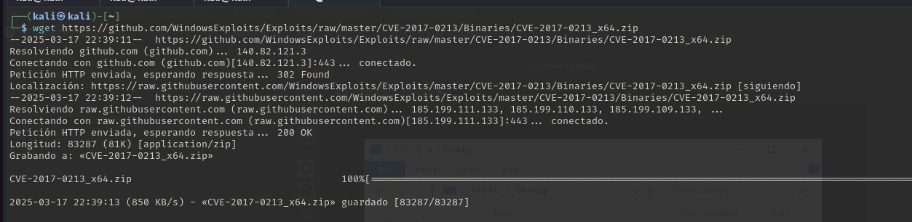

# Retro

Esta máquina se supone que es bastante similar a Blaster por lo que vamos a resolverla de la misma manera. 

Nos carga la misma pagina en le puerto 80 que en el baster.

Probamos a fuzzear y nos encuentra el directorio retro. 

Vemos que si entramos en reto es tambien el mismo directori que en blaster.

Los post siguen siendo subidos por Wade por lo que intuimos que el usuario va a seguir siendo Wade. 

Investigando encontramos este post donde nos dice que ha publicaod un nuevo post en su nuevo blog por lo que vamos a investigar. 

Como en Blaster podemos ver a la derecha como aparece una lista de post y abajo del todo un comentario. 

Vamos al comentario y como podemos ver igual que en Blaster la contraseña la deja guardada en una respuesta  a su propio comentario para no olvidarse. Por lo que tenemos usuario: wade y contraseña: parzival. 

Con los credenciales vimos en nmap que tenia el RDP abierto por lo que con Remmina vamos a probar a entrar al equipo. 

**En este momento ha cambiado la IP debido a que la máquina se apagó.**

Nos metemos dentro del sistema. 

Vamos a ver que hay en el archivo user.txt. Encontramos la primera flag. 

En el escritorio nos queda el Chrome y la papelera. Dentro de papelera hemos encontrado el script que utilizamos en Blaster para escalar privilegios.  

Si vemos el Chrome nos aparece un CVE guardado en los marcadores. 

Buscamos como explotar el CVE y nos dan estos pasos:
Pasos para explotar CVE-2019-1388
Identificar un programa que active el UAC:
Encuentra un ejecutable firmado que pueda desencadenar el cuadro de diálogo de UAC al ejecutarse como administrador.

Mostrar más detalles:
Cuando aparezca el cuadro de diálogo de UAC, selecciona la opción "Mostrar más detalles".

Ver información del certificado:
Haz clic en "Mostrar información sobre el certificado del editor" dentro del cuadro de detalles.

Abrir el enlace del emisor del certificado:
En la ventana del certificado, haz clic en el enlace proporcionado por el emisor del certificado. Esto abrirá un navegador web con privilegios elevados (NT Authority SYSTEM).

Usar el navegador para abrir el símbolo del sistema:
Una vez que el navegador esté abierto, utiliza la opción "Guardar como" para abrir una ventana del explorador de archivos.

En la barra de direcciones del explorador, escribe la ruta completa al ejecutable cmd.exe ubicado en C:\WINDOWS\system32\cmd.exe.

Presiona Enter y obtendrás una consola con privilegios elevados.
***
Ejecutamos el script y le damos a "Show more datails"

Le daremos "Show information about the publisher's certificate"

Y le damos a ver el certificado 

Nos abre esta ventana. El problema es que nos abre esta ventana que nos debería dejar abrirlo con un navegador pero no se porque no me deja ninguna opción. 

He buscado en internet pero lo unico que me aparecia era que podia ser un bug del servidor. Preguntando a compañeros de clase me dijeron que había un exploit en este [repositorio](https://github.com/WindowsExploits/Exploits/tree/master/CVE-2017-0213). 

Este lo pasaremos con un servidor de python debido a que no encontramos otra manera de pasarme el exploit. 

Nos descargamos el exploit del repositorio

Encenderemos el servidor python 

Nos conectamos al servidor python desde el servidor de windows y descargamos el exploit

Lo tenemos descargado

Vamos a ejecutarlo

Y nos abre la cmd

Comprobamos que somos el usuario sistema

Buscaremos ahora que tenemos permisos de administrador, la flag que nos falta en el directorio del Administrador. 

En el escritorio del administrador vemos el archivo root.txt

Miramos la flag. 
