# Nmap

Haremos un escaneo a la máquina para ver que puertos tiene abiertos: 

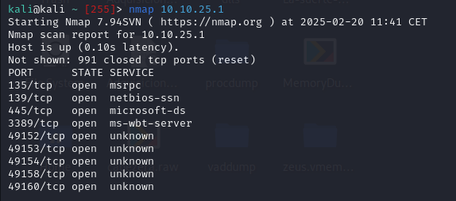

Ya hemos visto que puertos tiene abiertos. Ahora vamos a hacer un escaneo de las versiones y detectar vulnerabilidades. Esto lo haremos con `nmap -sV --script vuln "IP"`
Con -**sV** detectamos las versiones de los puertos abiertos y con **--script vuln** le ejecutamos un script de vulnerabilidades de nmap conocidas. 

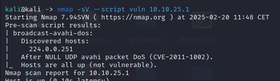

Una vez acaba de ejecutarse al final nos da un resumen de los resultados que ha encontrado. Aqui nos dice que ha encontrado una vulnerabilidad relacionada con SMB y nos da su CVE y su ms. 

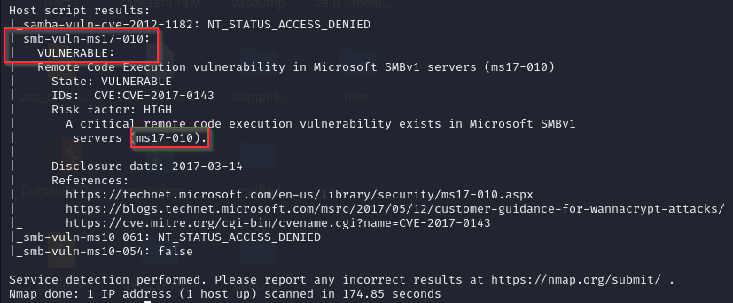

Iniciamos metaexploit y buscamos la vulnerabilidad encontrada. Con este comando nos dará la ruta del exploit. 

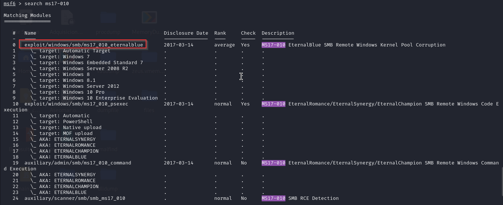

Seleccionaremos el exploit 
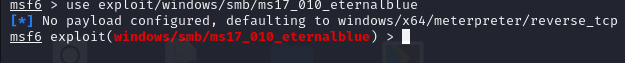

Con `show options` podemos ver que opciones nos deja configurar el exploit. 

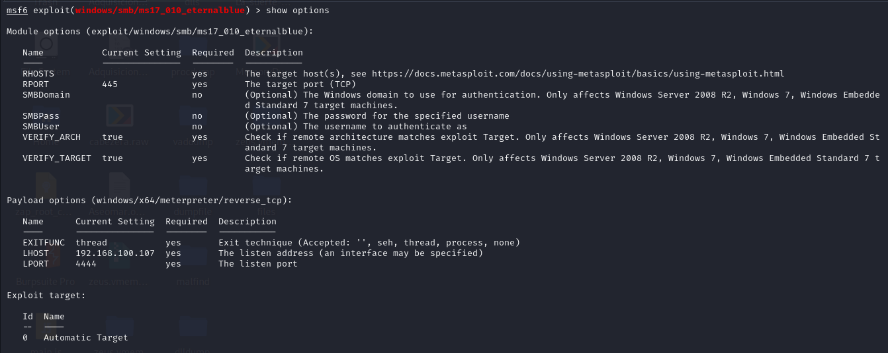

Aquí podemos ver los diferentes parámetros que podemos editar para ejecutar el exploit. Nosotros tendremos que configurar **RHOST** (IP del objetivo), **RPOT** (Puerto del objetivo, dejaremos el que tiene por defecto), **LHOST** (IP atacante) y **LPORT** (puerto del atacante, dejaremos el predeterminado). 

Editamos los parametros y vemos que se hayan configurado.
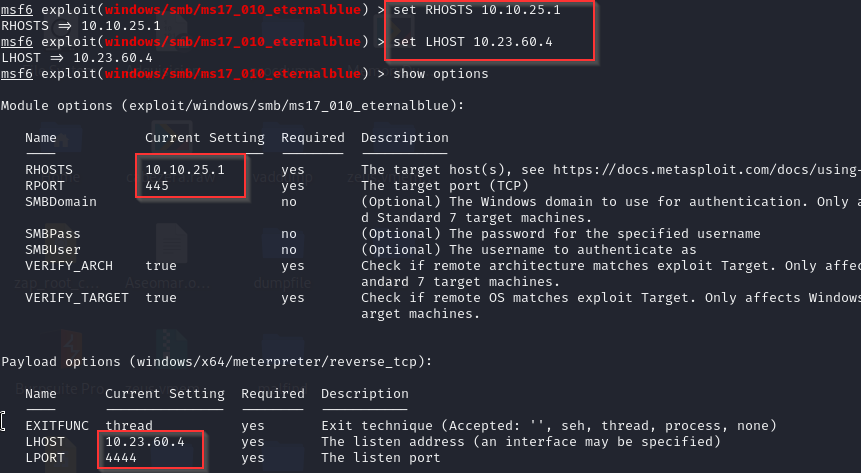

Y agregamos un payload de shell reverse.
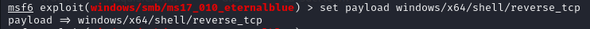

Una vez configurado todo ejecutamos el exploit con `exploit`.

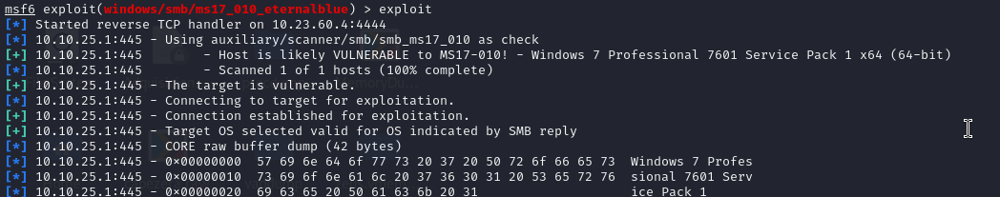

Si funciona correctamente nos meterá en la consola del sistema.
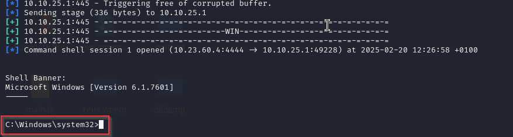

Nos dicen que dejemos 
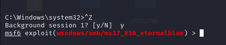

Nos piden que investiguemos como convertir un shell en un shell de meterpreter en metaexploir. 

En esta página nos explican como convertir la shell para meterpreter: [Enlace guía](https://docs.metasploit.com/docs/pentesting/metasploit-guide-upgrading-shells-to-meterpreter.html)

Miramos las sessiones.

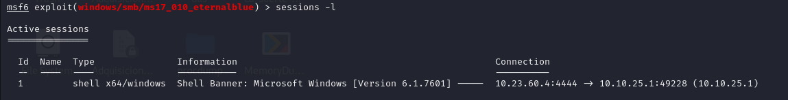

Nos dicen que usemos `use multi/manage/shell_to_meterpreter` donde podremos ver la ruta del exploit (post/multi/manage/shell_to_meterpreter).

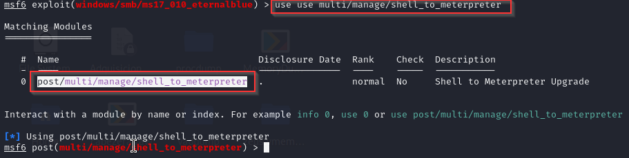

Vemos las opciones que nos deja seleccionar.

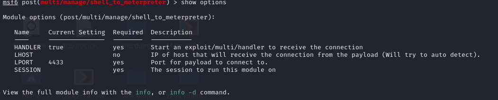

Editaremos LHOST (nuestra IP) y SESSION (id de la session que vimos antes), ya que LPORT lo dejaremos el que está por defecto. 

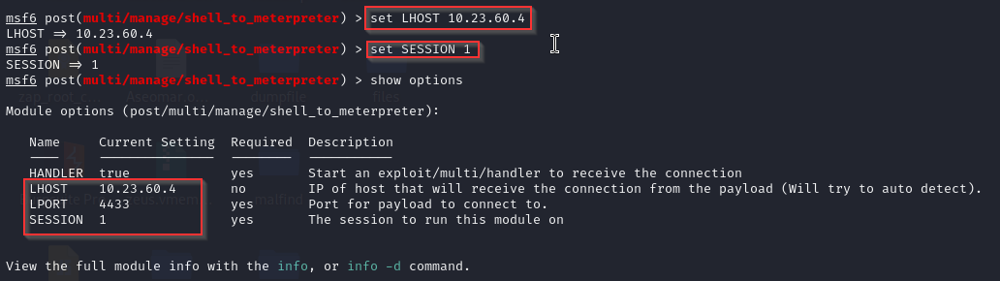

Y ejecutamos el exploit. 

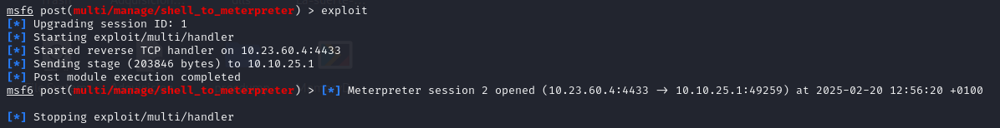

Nos dice que se ha creado el meterpreter en la session 2 por lo que vamos a comprobarlo. 

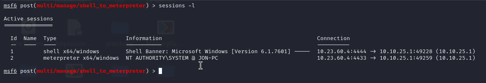. 

Nos conectaremos a la sessions creada. 
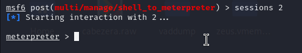

Una vez conectados dice que ejecutemos el comando `getsystem` y comporbemos que hemos escalado a SYSTEM.
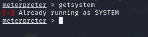
Nos dicen que ejecutemos una shell y ejecutemos whoami para ver si somos el sistema. 
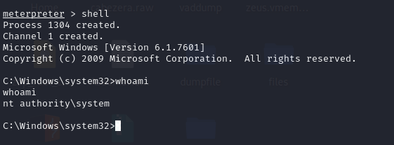

Una vez ejecutado dejamos eso en segundo plano y nos dice que listemos los procesos con `ps` y elijamos uno de los del final que esten ejecutandose por nuestro usuario  NT AUTHORITY\SYSTEM. 

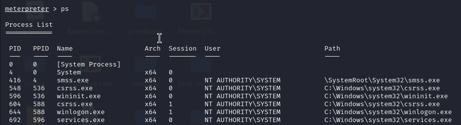

Nosotros hemos escogido este proceso ` 2664  692   SearchIndexer.exe     x64   0        NT AUTHORITY\SYSTEM
`
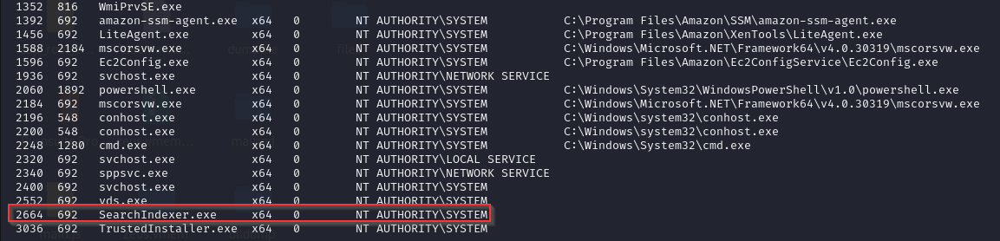

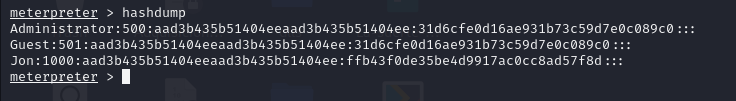

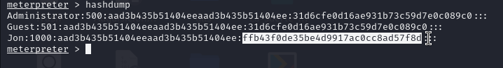

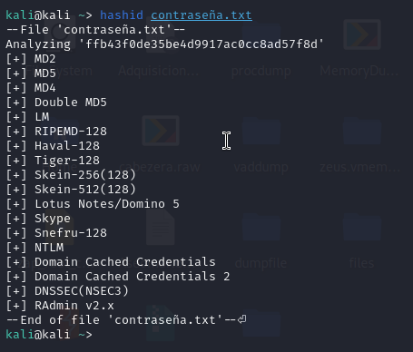

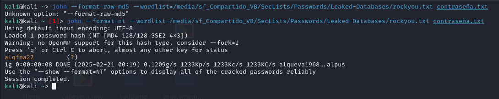

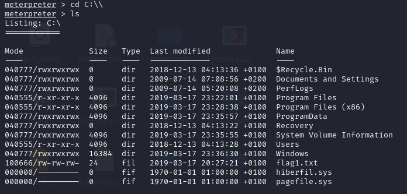

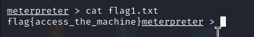

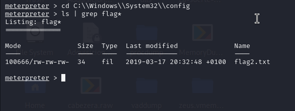
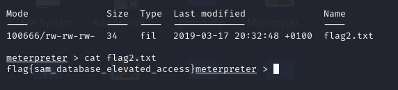

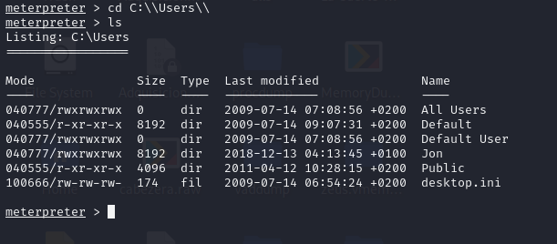
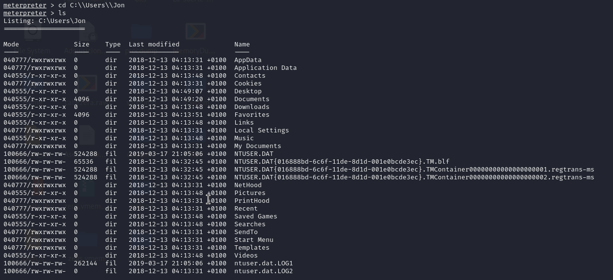

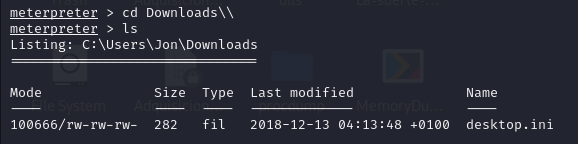
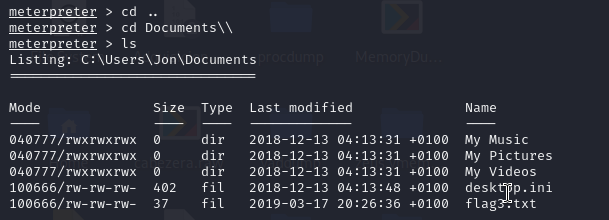
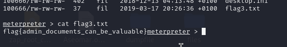
flag{access_the_machine}
flag{sam_database_elevated_access}
flag{admin_documents_can_be_valuable}