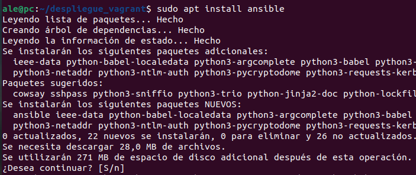
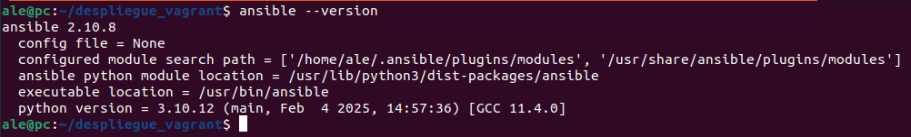
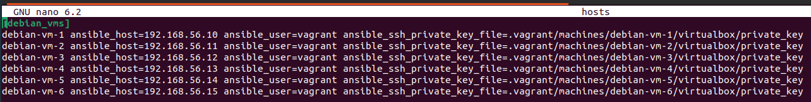
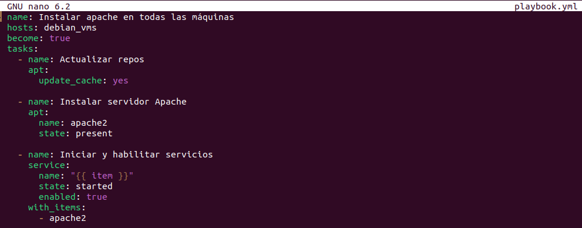
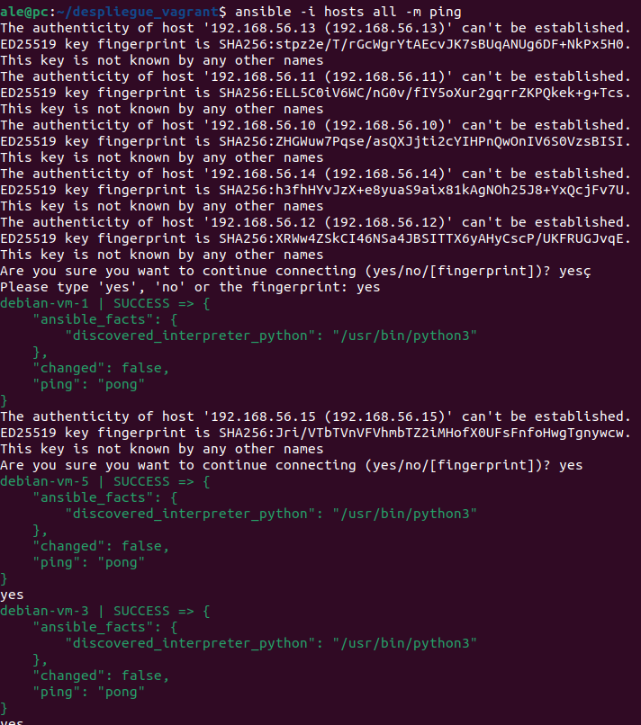
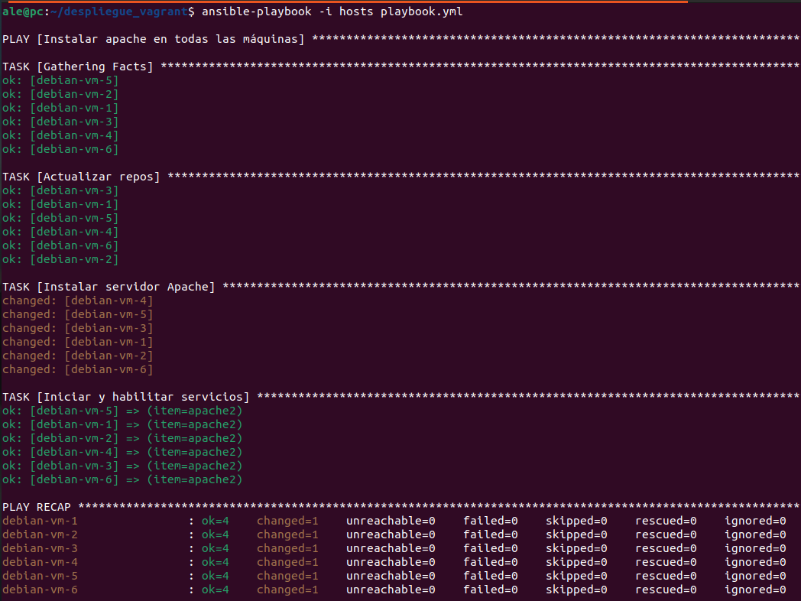
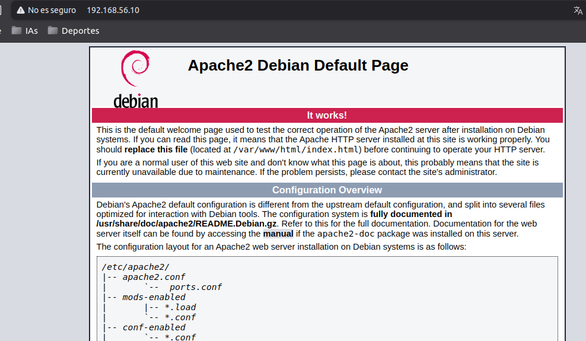
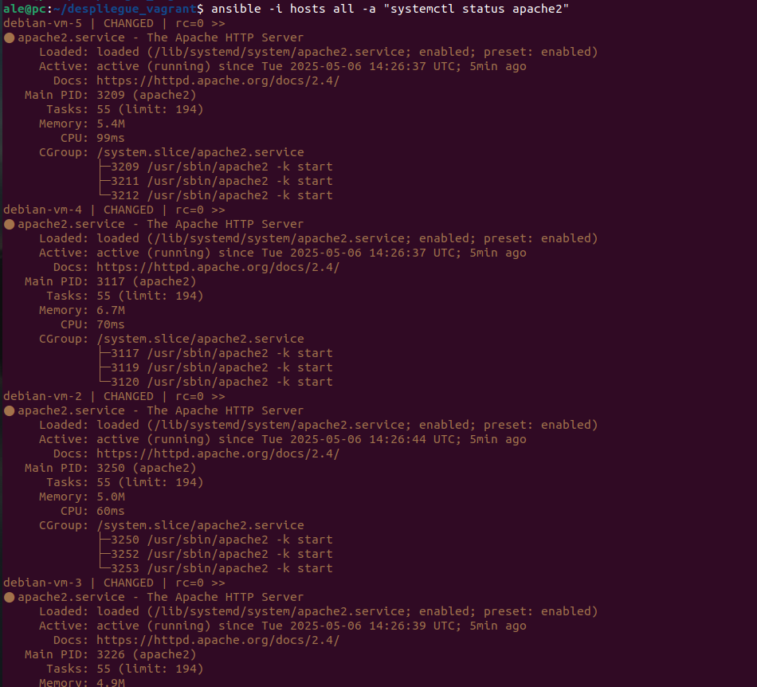
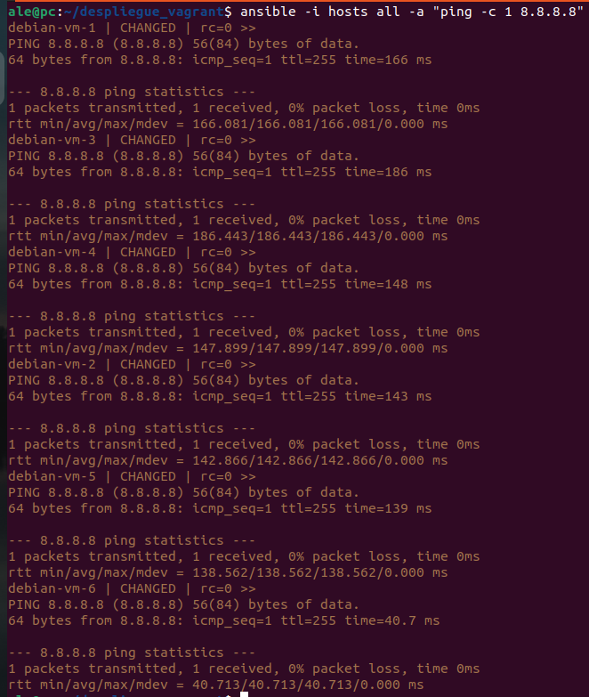

# Ejecución de comandos en varias máquinas usando ANSIBLE

En este documento vamos a explicar como utilizar Ansible para ejecutar comandos en muchas máquinas a la vez. Para ello vamos a utilizar la estructura que creamos anteriormente con Vagrant que puedes verla en este [enlace]().ç

Lo primero que haremos será instalar el paquete de `ansible`.

Comprobamos que se nos haya descargado correctamente viendo la versión.

Una vez descargado ansible procederemos a crear un archivo `hosts` en el cuál vendrá la información (nombre, IP...) que tenemos creadas con Vagrant.

También deberemos crear el archivo `playbook.yml`. En este archivo pondremos las configuraciones que queremos hacer en las máquinas. En este caso haremos un archivo de configuración que actualizará los repositorios de las máquinas, descargará apache e iniciará el servicio.

Aqui vamos a hacer una comprobación de que ansible funciona correctamente mandandoles un ping a todas las máquinas para ver que nos responden.

Una vez comprobado que funciona vamos a ejecutar el playbook.yml en las máquinas para instalar apache en todas ellas.

Ya acabado el proceso comprobaremos que se ha instalado apache poniendo la IP de la máquina 1 a ver si sale el index.html de apache.

Otra forma de poder verificar es mandandoles un comando a todas las máquinas para ver que el servicio de apache esta funcionando correctamente.

Y con esto hemos acabado y hemos visto las numerosas posibilidades que tiene ansible de poder ejecutar numerosos comandos a muchas máquinas.

