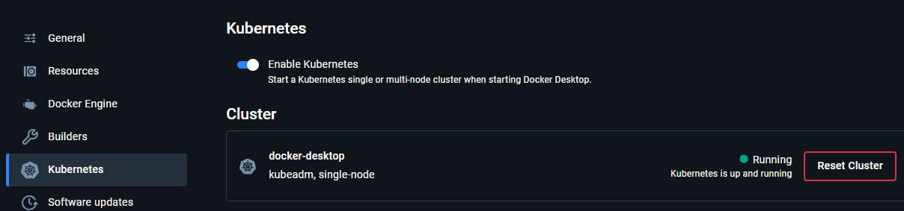
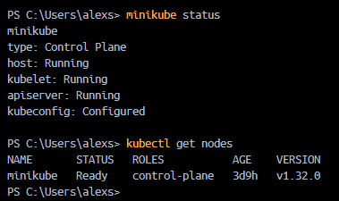

# Despliegue con kubernetes

## Enunciado

- Docker (en mi caso Docker Desktop, para crear la imagen del servidor FastAPI)
- Minikube (herramienta que te permite crear un cluster de Kubernetes local)
- kubectl (herramienta CLI para interactuar con el cluster de Kubernetes)

## Kubernetes

Lo primero que tendremos que asegurarnos es de tener activado kubernetes en Docker Desktop



Comprobamos que minikube este activo y conectado a nuestro docker correctamente. 



## Archivos

Para crear el servidor FastAPI tendremos qu ecrear varios archivos

- ### Crear la aplicación FastAPI

Crea un archivo `main.py`:

```python
from fastapi import FastAPI

app = FastAPI()

@app.get("/")
def read_root():
    return {"Hello": "World"}
```

- ### Crear Dockerfile

Crea un `Dockefile`:

```docker
FROM python:3.9
WORKDIR /code
COPY ./requirements.txt /code/requirements.txt
RUN pip install --no-cache-dir --upgrade -r /code/requirements.txt
COPY ./main.py /code/
CMD ["uvicorn", "main:app", "--host", "0.0.0.0", "--port", "8000"]
```

Crea `requirements.txt:`
```text
fastapi
uvicorn
```

- ### Crear archivo de Deployment

Crea `deployment.yaml`:
```text
apiVersion: apps/v1
kind: Deployment
metadata:
  name: fastapi-deployment
spec:
  replicas: 5
  selector:
    matchLabels:
      app: fastapi-app
  template:
    metadata:
      labels:
        app: fastapi-app
    spec:
      containers:
      - name: fastapi-app
        image: tu-usuario/fastapi-app:v1
        ports:
        - containerPort: 8000
```
- ### Crear archivo de Service

Crea `service.yaml`:

```text
apiVersion: v1
kind: Service
metadata:
  name: fastapi-service
spec:
  type: LoadBalancer
  ports:
  - port: 80
    targetPort: 8000
  selector:
    app: fastapi-app
```
- ### Aplicar configuraciones

```
kubectl apply -f deployment.yaml

> deployment.apps/fastapi-deployment created

kubectl apply -f service.yaml

> service/fastapi-service created
```

- ### Verificar despliegue

```
kubectl get pods

NAME                                  READY   STATUS             RESTARTS   AGE  
fastapi-deployment-77848b4c78-474tb   0/1     ImagePullBackOff   0          2m39s
fastapi-deployment-77848b4c78-8dg6b   0/1     ImagePullBackOff   0          2m39s
fastapi-deployment-77848b4c78-g8rx4   0/1     ImagePullBackOff   0          2m39s
fastapi-deployment-77848b4c78-kz7p5   0/1     ImagePullBackOff   0          2m39s
fastapi-deployment-77848b4c78-vn99z   0/1     ImagePullBackOff   0          2m39s
```

```
kubectl get services

NAME              TYPE           CLUSTER-IP      EXTERNAL-IP   PORT(S)        AGE  
fastapi-service   LoadBalancer   10.98.186.231   <pending>     80:30875/TCP   4m48s
kubernetes        ClusterIP      10.96.0.1       <none>        443/TCP        3d18h
```

```
minikube service fastapi-service
|-----------|-----------------|-------------|---------------------------|
| NAMESPACE |      NAME       | TARGET PORT |            URL            |
|-----------|-----------------|-------------|---------------------------|
| default   | fastapi-service |          80 | http://192.168.49.2:30875 |
|-----------|-----------------|-------------|---------------------------|
```


