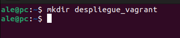
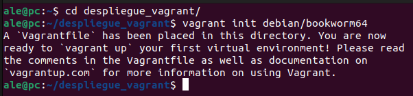
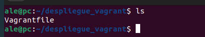
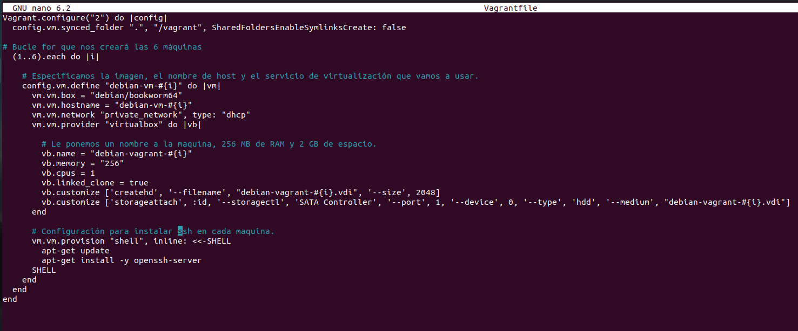
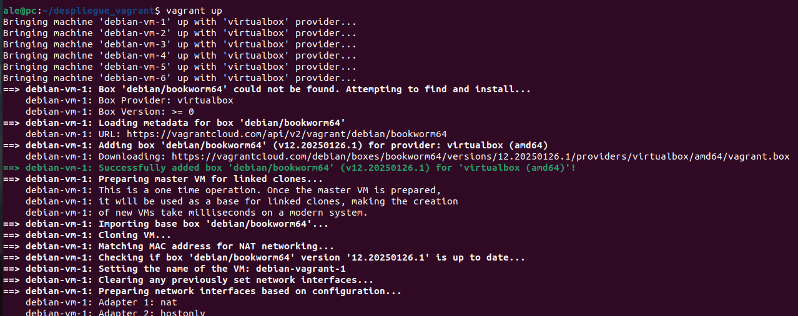
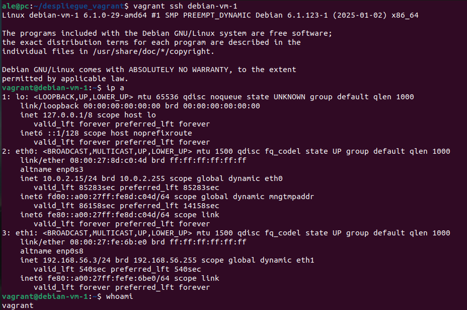
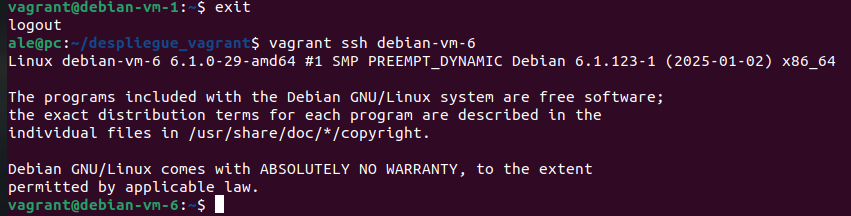

# Despliegue con vagrant

En este documento veremos como desplegar máquinas virtuales usando Vagrant. Vagrant es una herramienta de línea de comandos que permite crear y gestionar máquinas virtuales configuradas mediante un archivo llamado Vagrantfile, facilitando la creación de entornos de desarrollo portables y reproducibles.

## Herramientas necesarias

- [VirtualBox](https://www.virtualbox.org/) - 7.1.6

- [Vagrant](https://www.vagrantup.com/) - 2.4.5

## Creación directorio de trabajo

Lo primero que haremos será crear un directorio donde configuraremos las opciones para crear las máquinas virtuales.

Entramos dentro de el y ejecutaremos el comando `vagrant init debian/bookworm64`.

Esto nos creará el archivo `Vagrantfile` con una configuración por defecto.

Borraremos todo su contenido y le agregaremos la siguiente configuración. POdemos ver 4 partes en el archivo:

- Bucle donde hacemos que se repita todo el proceso 6 veces para crear 6 máquinas.
- Especificaciones sobre la imagen, el hostname dentro de la maquina y que servicio de virtualización usaremos.
- Especificaremos el nombre de la máquina, la RAM que le pondremos y el espacio de disco.
- Configurar para instalar SSH en todas las máquinas, para después poder conectarnos.

Una vez creada la configuración ejecutamos el archivo con `vagrant up`.

Vemos como después de ejecutarse el comando nos aparece en VirtualBox las 6 máquinas encendidas.

Ahora vamos a probar a conectarnos a una máquina a través de ssh. Vemos como nos conecta y podemos ejecutar comandos en ella como ver el usuario o la ip de la máquinas.

Comprobamos que el bucle haya funcionado correctamente y la última máquina nos conecta también bien.

